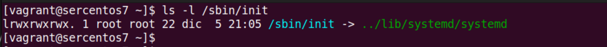

# LPI LPIC-1 System Administrator

LPIC-1 includes 2 exams includes/requires 2 exams - 101 & 102

## LPIC-1 Exam 101

- Created in 1999 ~ about 10 years after 1st Linux kernel release
- In 2010 LPIC teamed up with CompTIA to create combined set of exams (LXO-103 & LXO-104), passing both of those lead to LPIC-1 & Linux+ certifications, but those exams retired in 2019
- Entry level, distribution agnostic
- Current version - V5, not tied to CompTIA Linux+
- 60 questions - multiple choice & fill-in the blank / 90 minutes
- 5 years validity

4 main topics:

- System Architecture
- Linux Installation & Package Management
- GNU & Unix Commands
- Devices, Linux Filesystem, Filesystem Hierachy Standard

[Exam 101 Objectives list](https://www.lpi.org/our-certifications/exam-101-objectives)

Contents/topics covered:
- Linux system administration
- System Architecture
- Installation of a Linux sustem and installing software
- Commonly used Linux commands
- Understanding Linux file system and how it works with different types of hardware

Prerequisite knowledge:

- LPI Linux Essentials
- Some familiarity with Linux

## 101.1 Determine and configure hardware settings

### Pseudo File Systems (PFS)

**Regular File System**
- method of laying out files and folders on a physical disk

**Pseudo File System**
- do not exist on a physical hard disk (pseudo = fake/not real)
- only exists in a RAM while system is running
- on boot kernel creates pseudo file system

In Linux everything is a file/seen as a file - including processes, folders and devices.

Two primary pseudo file system locations in Linux are **/proc** and **/sys**

#### /proc

- /proc - contains **PID subfolders**; this PFS contains information about the **processes** running on a system, processes are listed by PID, with HW and process data both in the same directory structure
  - PID folders for processes
    - 1 - first process which starts on the system's boot / init process directory, initialization system
      - 1/cmdline - command related to process 1 - systemd
  - cpuinfo file - contains info about CPU, gets created in real-time and lives in memory as everything within /proc PFS
  - meminfo file
  - partitions file
  - uptime file
  - version file
  - etc.

- /proc PFS is useful source of info about your system and running processes.

#### /sys

- /sys - contains information about the system's **hardware and kernel modules**. No process information listed here.
  - /block
  - /bus
  - /class
  - /dev
  - /devices
  - /firmware
  - /fs - file systems used on machine, - cgroup, xfs etc., inside of FS sub directory we can find partitions sub directory etc.
- hypervisor
    - cgroup
    - pstore
    - resctrl
    - selinux
    - xfs
      - xvda1
        - error
        - log
        - stats - partition's file system statistics
          - stats file
          - stats_clear file
  - /hypervisor
  - /kernel
  - /module
  - /power

**/sys** - HW and kernel info is exposed in plain text files within this PFS/provides info about the kernel (hardware devices and their device drivers) through user space

We can see local documentation on the /proc PFS using *man proc* command.

**Everything is seen by Linux as a file.**

### Working with Kernel Modules

#### Linux Kernel

Linux Kernel
- Core framework of the GNU/Linux OS
  - GNU part - tools such as bash commands, various types of shell and utilities
  - Linux part - Linux kernel
- Provides a way for the rest of the system to operate with its HW, memory, networking, and itself (kernel's communication with its own various subsystems)
- Linux kernel is **monolythic kernel**
    - The kernel handles all memory management and HW device interactions
    - Extra functionality can be loaded and unloaded dynamically through **kernel modules**
    - Ensures that the system won't need to be rebooted into different kernel image for added functionality
- Many 3rd-party Linux kernel modules are **device drives**

#### Linux Kernel Utilites

**uname**

uname - displays information about the currently running kernel

```Bash
## uname - returns basic kernel info
uname -m # bitness / machine harware name - x86_64
uname -rm # kernel-release + bitness/machine hardware name - x86_64
uname -a # print all info
# Sample uname -a output
# Linux WORKSTATION1 5.10.102.1-microsoft-standard-WSL2 #1 SMP Wed Mar 2 00:30:59 UTC 2022 x86_64 x86_64 x86_64 GNU/Linux
```

**lsmod, modinfo, modprobe**

lsmod - displays a listing of all currently loaded kernel modules
modinfo - displays information about a specified kernel module
modprobe - command used to dynamically load and unload kernel modules at runtime

```Bash
### lsmod = list modules
lsmod # list Kernel modules + memory used by each module along with modules which are dependent on listed module
# output includes module name, size and used by information - which lists other modules which use this module

### modinfo
modinfo <module name> # get info about specific Kernel module
# Load/unload kernel modules

### modprobe
# -r to unload module / -r, --remove = Remove modules instead of inserting
modprobe -r <module name> # unload kernel module (use with caution, can break the system)
modprobe <module name> # load kernel module
```

### Investigating Hardware

#### Linux Device Management

**/dev, udev, D-Bus**

- **/dev** - **PFS** which contains information on all of the system's connected HW
- **udev service** - Linux service which acts as a **device manager** for the Linux kernel, links information on system HW to /dev PFS; detects newly connected HW (e.g. disk) and passes info about it through **D-Bus service** to /dev PFS
- **D-Bus service** - data bus service, sends data messages between applications, a conduit of information about what is going on in the system, udev utilizes dbus to notify users and the system when new HW is attached
  - passes all information about everything that goes on within the Linux system to other services and devices
  - new device gets attached to /dev PFS which contains actual **handles** to all devices that connected to the system
  - when other apps trying to access HW, e.g. when accessing disk with lsblk (ls block, to list all the block devices) it goes through D-Bus to /dev PFS to get info about the device

**/dev PFS**

/dev/cpu - numbered subfolders for each CPU core, microcode
/dev/dri - video cards (DRI = Direct Rendering Interface)
/dev/nvme0 - SSD disk
/dev/nvme0n1 - SSD disk
/dev/nvme0n1p1 - SSD disk partition
/dev/sda - USB hard drive
/dev/usb - USB removable devices, you can connect/disconnect USB device to see how corresponding file appears/disappears under this PFS

All files under /dev PFS are binary/not human readable.

#### Listing devices - lspci, lsusb, lscpu, lsblk

Set of commands which retrieves data from /dev PFS.

**lspci** - Displays information on PCI devices attached
**lsusb** - Displays information on USB devices attached
**lscpu** - Displays information on processors on a system
**lsblk** - Displays information on all block devices on a system

```Bash
### lspci - Displays information on PCI devices attached
lspci # lists all PCI devices currently attached to the system (queries /dev and returns what is connected to PCI bus) - USB controllers, NICs, memory controller, sound/video cards, card riders etc.
# -k = Show kernel drivers handling each device
# -v = Be verbose (-vv or -vvv for higher verbosity)
lspci -k # to see which HW components use which Kernel modules (Kernel driver in use, Kernel modules)
lspci -k -v # to see even more info (verbose) - to view capabilities

### lsusb - Displays information on USB devices attached
lsusb # to list all USB devices attached to the system (disks, root hubs/controllers)
lsusb -v # verbose
lsusb -t # tree view to see which USB device attached to which controller

### lscpu - Displays information on processors on a system
lscpu # list CPU info

### lsblk - Displays information on all block devices on a system
lsblk # list hard disks (block devices) - NAME / MAJ-MIN / SIZE / RO / TYPE / MOUNTPOINT
lsblk -f # to get file system used by each partition (FSTYPE)
```

#### Recap - 101.1 Determine and configure hardware settings

**sysfs** - is a PFS that provides information about the kernel (such as hardware devices and their device drivers) through user space. The sysfs filesystem is **commonly mounted at /sys**. Typically, it is mounted automatically by the system.

**/proc** - is a PFS that contains the processes that are currently running on the system, each with their own directory named after their PID. 

**udev** - is a device manager service for Linux.

**modprobe** - this command loads a kernel module into memory.
**modprobe -r <module name>** - this command unloads Kernel module (use with caution, can break the system).

**lsusb** - this command allows to view the hot-pluggable devices currently connected to your system; USB devices are considered hot pluggable (or hot swappable), and this command lists those that are connected to your system.

**lsblk** - this command lists the block devices (such as hard disks) on your system.

## 101.2 Boot the System

### The Linux Boot Sequence

#### The Linux Boot Process (Simplified)

- **Machine powers on**
- **BIOS** - checks all the HW and IO devices, once checks completes boot process begins
- **Boot program**, most frequently **GRUB (Grand Unified Boot Loader)** on modern Linux distros looks for an HDD section containing the data needed to boot an OS (**boot sector on the first hard drive**), and loads the Linux Kernel
- **Linux Kernel** - Linux Kernel loads an Initial RAM Disk
- **Initial RAM Disk** - contains drivers and starts to load drivers and then mount the file system from HDD, once Kernel is fully loaded it starts **initialization system**
- **Init system** - starts services/daemons, once started it takes over mounting file systems and at this point initial RAM disk is no longer needed and gets removed, init system continues loading services and gets machine to the state when it is fully ready to use

#### Boot Logs

**dmesg** - the traditional utility used for viewing the kernel ring buffer; you may want to look at these logs to check if HW is getting recognized by Linux kernel when it is not being recognized by by udev or does not shows up under /dev PFS.

**dmesg** is a **legacy** method to pull up information from the kernel ring buffer.

```
udev (userspace /dev) is a device manager for the Linux kernel. As the successor of devfsd and hotplug, udev primarily manages device nodes in the /dev directory. At the same time, udev also handles all user space events raised when hardware devices are added into the system or removed from it, including firmware loading as required by certain devices.
```

**journalctl** - systemd utility to view the kernel ring buffer within the systemd journal; on modern Linux distros **systemd** is used instead of old init, and with systemd comes **journalctl** command which queries journal (event log whhich logs every event within the system, including kernel/dmesg messages).

```Bash
# dmesg - Display or control the kernel ring buffer
dmesg # the traditional utility used for viewing the kernel ring buffer

# journalctl - Query the journal
# -k --dmesg - Show kernel message log from the current boot
journalctl -k # systemd utility to view the kernel ring buffer within the systemd journal
# with -k / --dmesg you will see kernel/dmesg messages/events, e.g. kernel command line options which were used when the system was booted (see below), system BIOS info
# Command line: BOOT_IMAGE=/boot/vmlinuz-5.15.0-53-generic root=UUID=6fd52fc1-ba3f-4e4c-983b-bdb39b9a7c2c ro quiet splash vt.handoff=7
```
- These logs are volatile - gets overwritten on every reboot
- Generated from an area known as the **Kernel Ring Buffer** - RAM area to which Kernel wrties all its system messages
- **dmesg** - shows info on the HW that kernel can see and how it activates it, low level memory management messages; typically used to see if HW is getting recognized by the Linux Kernel (when it may not be recongnized by udev or not show up in /dev PFS); considered to be legacy command to pull up information from Kernel Ring Buffer
- **journalctl** - on the most of modern Linux distributions systemd is used instead of old init system amd with it journalctl command can be used - it logs every event occurring within the system, part of those logged events are kernel messages (the same which can be seen with dmesg command); to view kernel messages we use *journalctl -k* (k switch indicates that we want to see all kernel messages)

### init

#### init basics

- init - short for initialization
- based on the System V init used in UNIX systems
- sysvinit - written by Miquel Van Smoorenburg
- **services are started one after the other**, sequentially/in a serial fashion - that approach was choosen for the sake of simplicity

#### init startup

- when Linux kernel is loaded and initial RAM disk is created it looks up for initialization system to hand over control to it
- **/sbin/init** - the first place where kernel looks up for **initialization system**, once init program is located its get started and takes control
- **/etc/inittab** - once init is started it reads **configuration** from /etc/inittab file
- init reads /etc/inittab file to determine what **runlevel** the system should be operating in (predefined configuration)
- each runlevel starts and/or stops scripts for various services depending on how the system should be set up
- **system can operate in 1 runlevel at a time**, runlevel applies to the system as a whole / **system-wide option**, not a per user option

#### Linux Runlevels

Run levels based on Linux Standards v4.1, some Linux distros such as Slackware and Gentoo use slightly different configuration.

| Runlevel | Purpose                                 |
|----------|-----------------------------------------|
| 0        | Halt/Shutdown                           |
| 1        | Single-user mode (root only)            |
| 2        | Multi-user mode without networking      |
| 3        | Multi-user mode with networking         |
| 4        | unused                                  |
| 5        | Multi-user mode with networking and GUI |
| 6        | Reboot                                  |

- 0 - **Halt/Shutdown** level - init run scripts that stop services and powers off the system
- 1 - **Single user mode** level, typically the root is the only user allowed to login into the system at the run level, primarily used for maintenance tasks and repair functionality
- 2 - **Multi-user mode without networking** (all interfaces are down, no remote FS are mounted)
- 3 - **Multi-user mode with networking**, historically most Linux servs were setup to run at this level by default
- 4 - Typically **not used**, but **available if admin want to setup a custom runlevel environment**
- 5 - **Multi-user with networking and GUI**, older Linux workstation with desktop environment were configured to run in level 5 by default
- 6 - **Reboot** runlevel, init stops services and restarts the system going through complete boot up sequence once again

#### inittab file

```The  /etc/inittab  file was the configuration file used by the original System V init(8) daemon.```
```The Upstart init(8) daemon does not use this file,  and  instead  reads its  configuration  from  files  in  /etc/init. See  init(5) for more details.```

- Location - /etc/inittab
- Contents lines of the following format: <identifier>:<runlevel>:<action>:<process> 
- Sample line (ID=3, action=initdefault, process field is empty): ```id:3:initdefault (no action)```
- Sample line (action rc.sysinit, no runlevel as it is init process): ```si::sysinit:/etc/rc.d/rc.sysinit```
- each line specifies a runlevel

10:0:wait:/etc/rc.d/rc 0
10:0:wait:/etc/rc.d/rc 1
10:0:wait:/etc/rc.d/rc 2
10:0:wait:/etc/rc.d/rc 3
10:0:wait:/etc/rc.d/rc 4
10:0:wait:/etc/rc.d/rc 5
10:0:wait:/etc/rc.d/rc 6

wait - the process specified will be started once when runlevel is entered, and init will wait for its termination

#### Boot sequence

- Boot partition found - Filesystem type is ext2fs, partition type 0x83
- Kernel and initial RAM disk are loaded - kernel, initrd
- Kernel pulls initial drivers and set up tools from RAM disk
- Kernel hands the control over to **/sbin/init** - first place where kernel looks up for initialization system, to locate init system
- init reads configuration from /etc/inittab file and performs system maintenance tasks from /etc/rc.d/rc.sysinit
- once init has read the **initdefault line** in /etc/inittab, it enters runlevel 3 and starts up scripts corresponding to this level
- once all scripts and services are loaded the system is ready for use

#### Init scripts (runlevels)

```Bash
# RedHat based - /etc/rc.d
# Debian based - /etc/init.d
# rc = run commands
ls /etc/rc.d
init.d
rc
rc.sysinit # script that does some house cleaning before we enter into specific runlevel defined in the inittab file
rc.local # run after the runlevel is completely loaded, usually customized by the sys admin to start up extra services or tasks which do not have their own init scripts
# rc0 - rc6 directories pertain to specific runlevels
# inside we can se symbolic links to original script files located under etc/init.d
# symlinks are named in a specific way
# - begin with K letter (indicate that services that are to be killed) 
# - begin with S letter (scripts/services to be started)
# - and followed by NN number which indicates numerical order in which these scripts will be killed and started
# e.g. ip6tables and iptables are started before network is started etc.
# S08ip6tables
# S08iptables
# S10network
rc0.d
rc1.d
rc2.d
rc3.d
rc4.d
rc5.d
rc6.d
# View symlinks
ls -l /etc/rc3.d/
```

init
- **/etc/init.d** - directory that contains the scripts for the services on the system
  ```ls -l /etc/rc.d/rc3/d/S10network```
  ```/etc/rc.d/rc3/d/S10network -> ../init.d/network```
- **/etc/init.d/rc** - script that orchestrates how the runlevel scripts run and what occurs when a runlevel changes

### upstart

#### Upstart key characteristics/background

Upstart init daemon was made popular by Ubuntu distribution.

- First developed for Ubuntu in 2006 by Scott Remnant
- First used in Ubuntu 6.10
- Eventually included in RedHat Enterprise Linux 6, Debian and Fedora 9
- Design goal - **abiltity to start and stop services in asynchronous fashion**
- Unlike init, upstart is capable to start service asynchronously which **decreases boot up times**
- Upstart works with **real-time events**, which init was not designed to understand
  - Upstart not only stop and start services but also monitors their availability (can restart service when it stops unexpectedly)

#### init VS upstart - Boot Sequence

init:    **/sbin/init** > /etc/inittab > /etc/rc.d/rc.sysinit > /etc/rc.d/rcX.d (in sequential order) > login

upstart: **/sbin/init** > startup event (man page 7) > mountall (8) 
                                                 > /etc/init/rc-sysinit.conf > telinit (8) > runlevel (7) command to switch to default runlevel (not the same as System V init runlevel) > /etc/init/rc.conf > login

* Upstart daemon is named init as well for backward compatibility with the kernel
* Some of the upstart components work in parallel to reduce boot time

upstart boot sequence (simplified):

- /sbin/init - Linux kernel looking for initialization daemon named init within **/sbin directory**, and upstart is **named init** to support this/for backward compatibility
- startup - upstart initialization daemon then fires off the **startup event**
- **mountall** - startup event checks and mounts the drives that make up file system using mountall tool
- loads HW drivers - startup event loads HW drivers
- **/etc/init/rc-sysinit.conf** script - as FSs come online startup runs /etc/init/rc-sysinit.conf script which checks to see if there is an **/etc/inittab** file to see if there are any configuration options set there
- /etc/init/rc-sysinit.conf calls **telinit** to switch into default runlevel via the **runlevel command**
- **runlevel command** - starts many other jobs from upstart to get the system ready and also provides compatibility mechanism to legacy scripts which may require specific run levels by executing **/etc/init/rc.conf job** and passing the expected run level as an argument
- after startup event begins there are multiple other jobs that are runningin parallel which are not mentioned above

#### upstart Service Monitoring

- **init is static**; it does not natively respon to changes on a system
- **upstart is dynamic**, it can respond to changes on the system
- A change on a Linux system is an **event** (new monitor plugged in, etc.)
- Events trigger jobs
- Jobs fall into 2 categories
  - **Tasks** - perform task and return to waiting state on completion
  - **Services** - do not stop by itself (only stops in response to event call)

Job States:

- waiting - initial job state waits for events
- starting - job is about to start
- running - job is currently running
- **stopping - job has processed its prestop configuration section**
- **killed - job is stopping**
- **post-stop - job is stopped**
- **respawning** - occurs when something goes wrong with job/when it quits unexpectedly while in running state, upstart will attempt to respawn the job up to 10 times with 5 second intervals before job gets dropped entirely

**Currently no Linux distribution are using upstart anymore** - upstart just an illustration of init system which introduced move from static start/shutdown mechanism to a one which is aware of what's going on in the system and reacts to changes/events.

### systemd

#### systemd - Getting rid of shell scripts

- init and parts of upstart rely on Bash shell scripts
- systemd removed the need to have **shell scripts** which **have to be run through Bash interpreter which implied spawning new processes for each command within the shell script** (each of these processes then have to open up a library file required by command) which lead to an inefficient use of time
- systemd replaces most of the functionality of the shell scripts with **equivalent functionality written in compiled C code** (not all was replaced, but whatevere is replaced is way faster)
- still compatible with older System V init scripts
  - NOTE: the creators of systemd have emphasized that it is not 100% compatible (close to 99%) with old init system, as it was very extensible and there is no compatibility developed for every possible scenario
- instead of old **bash init scripts** systemd uses **unit files**

#### Unit Files Locations

3 main locations:
- **/usr/lib/systemd/system** - Default location provided by package installations
  - do not edit these unit files, as they can potentially be modified by package updates
- **/etc/systemd/system** - Unit file location for system administrators (these take precedence over those in /usr)
- **/run/systemd/system** - Runtime unit files

To view all unit files on a system: 

```Bash
systemctl list-unit-files
```

#### Components of the Unit File

- Unit files follow the INI style format first seen in MS-DOS, lines:
  - [Unit]
  - Description=Multi-User System
  - Documentation=man:systemd.special(7)
  - Requires=basic.target (lists out the units that will also be activated when this unit is activated)
    - or Wants= (similar to Requires, but more robust - won't prevent unit to start in case unit(s) specified here fail to start) 
  - Conflicts=rescue.service rescue.target (what units can not be running when this unit is active)
  - After=basic.target rescue.service rescue.target (lists units that must be started before this unit started, Before directive is the oposite of After
- man 5 systemd.unit - full documentation on the systemd unit file
- systemctl cat something.unit - will print out the contents of the unit file specified, e.g. *systemctl cat httpd.service*

```Bash
systemctl cat httpd.service
# /usr/lib/systemd/system/httpd.service
[Unit]
Description=The Apache HTTP Server
After=network.target remote-fs.target nss-lookup.target
Documentation=man:httpd(8)
Documentation=man:apachectl(8)

[Service]
Type=notify
EnvironmentFile=/etc/sysconfig/httpd
ExecStart=/usr/sbin/httpd $OPTIONS -DFOREGROUND
ExecReload=/usr/sbin/httpd $OPTIONS -k graceful
ExecStop=/bin/kill -WINCH ${MAINPID}
# We want systemd to give httpd some time to finish gracefully, but still want
# it to kill httpd after TimeoutStopSec if something went wrong during the
# graceful stop. Normally, Systemd sends SIGTERM signal right after the
# ExecStop, which would kill httpd. We are sending useless SIGCONT here to give
# httpd time to finish.
KillSignal=SIGCONT
PrivateTmp=true

[Install]
WantedBy=multi-user.target
```

#### systemd is the new init

systemd boot sequence
- The kernel still looks for /sbin/init
- systemd just took the place of /sbin/init (via symbolic link /sbin/init > /lib/systemd/systemd)



### Recap - 101.2 Boot the System

#### sysvinit runlevels

- 0 - **Halt/Shutdown** level - init run scripts that stop services and powers off the system
- 1 - **Single user mode** level, typically the root is the only user allowed to login into the system at the run level, primarily used for maintenance tasks and repair functionality
- 2 - **Multi-user mode without networking** (all interfaces are down, no remote FS are mounted)
- 3 - **Multi-user mode with networking**, historically most Linux servs were setup to run at this level by default
- 4 - Typically **not used**, but **available if admin want to setup a custom runlevel environment**
- 5 - **Multi-user with networking and GUI**, older Linux workstation with desktop environment were configured to run in level 5 by default / aka X11
- 6 - **Reboot** runlevel, init stops services and restarts the system going through complete boot up sequence once again

#### Linux boot order/sequence

BIOS > Boot Sector (with the Boot Loader), Kernel, Initial RAM Disk, Device Initialization

Commands to view output from the kernel ring buffer

- *journalctl -k* - systemd journal command lets you view kernel messages from the ring buffer
- *dmesg* - displays text from the kernel ring buffer

#### Linux Initialization systems

- **sysvinit** - classic initialization system used on Linux systems, written by Miquel Van Smoorenburg, services are started one after the other, sequentially/in a serial fashion - that approach was choosen for the sake of simplicity
- **upstart** - replacement initialization system originally developed for the Ubuntu distribution

**/sbin/init** - binary used by kernel to bring up the rest of the system and start services / first place where kernel looks up for initialization system, to locate init system

Initial RAM disk
- Gets unmounted when init system takes over and mounts the computer's file systems

#### Getting output from the kernel ring buffer

```Bash
dmesg # this command displays text from the kernel ring buffer
journalctl -k # this is the systemd journal command that lets you view kernel messages from the ring buffer
```

## 101.3 Change Runlevels/Boot Targets and Shutdown or Reboot the System

### Change Your Working Environment - Runlevels

#### Runlevel Review

Runlevels available in a classic systemv and upstart systems

- 0 - **halt/shutdown**
- 1 - **single user mode**
- 2 - **multi-user mode without networking**
- 3 - **multi-user mode with networking**
- 4 - **unused** (reserved for custom environments)
- 5 - **multi-user with networking and GUI**
- 6 - **reboot**

#### Runlevel Commands

Runlevel commands available in a classic systemv and upstart systems

```Bash
runlevel # view your current runlevel, N 3 output - N means that there was no previous runlevel and number is a current run level
telinit # change to another runlevel
init N # change to another runlevel, requires root (su -)
cat /etc/inittab # view default runlevel
```
Changing runlevels at boot - interrupt the GRUB boot process by pressing any key during startup, then at the GRUB selection menu, highlight a kernel to modify, press the "a" key to add arguments to the end of a kernel line, enter in a runlevel number

### Change Your Working Environment - targets

Components of the Unit File

- systemctl cat something.unit, e.g. systemctl cat httpd.service, this will print out the contents of the unit file specified

```Bash
systemctl cat httpd.service
# /usr/lib/systemd/system/httpd.service
[Unit]
Description=The Apache HTTP Server
After=network.target remote-fs.target nss-lookup.target
Documentation=man:httpd(8)
Documentation=man:apachectl(8)

[Service]
Type=notify
EnvironmentFile=/etc/sysconfig/httpd
ExecStart=/usr/sbin/httpd $OPTIONS -DFOREGROUND
ExecReload=/usr/sbin/httpd $OPTIONS -k graceful
ExecStop=/bin/kill -WINCH ${MAINPID}
# We want systemd to give httpd some time to finish gracefully, but still want
# it to kill httpd after TimeoutStopSec if something went wrong during the
# graceful stop. Normally, Systemd sends SIGTERM signal right after the
# ExecStop, which would kill httpd. We are sending useless SIGCONT here to give
# httpd time to finish.
KillSignal=SIGCONT
PrivateTmp=true

[Install]
WantedBy=multi-user.target
```

#### Purpose of a systemd target

- A target is a unit that **syncs up other units when the computer boots or changes states**
- Often used to bring the system to a new state
  - a state with just a CLI - multi-user.target
  - a state with a desktop environment - graphical.target
- Other units associate themselves with a target for an operating environment

#### Types of targets

- multi-user.target - multi-user system, similar to what runlevel 3 provided
- graphical.target - multi-user system with a desktop environment, similar to what runlevel 5 provided
- rescue.target - pulls in a basic system and file system mounts and provides a rescue shell
- basic.target - basic system, used during the boot process before another target takes over
- sysint.target - system initialization
- reboot.target
- poweroff.target
- man 5 systemd.target - defines the target unit configuration
- man 7 systemd.special - listing of all target units definitions

#### Target units

```Bash
systemctl cat graphical.target # view unit file for the graphical.target

###

# /usr/lib/systemd/system/graphical.target
#  This file is part of systemd.
#
#  systemd is free software; you can redistribute it and/or modify it
#  under the terms of the GNU Lesser General Public License as published by
#  the Free Software Foundation; either version 2.1 of the License, or
#  (at your option) any later version.

[Unit]
Description=Graphical Interface
Documentation=man:systemd.special(7)
Requires=multi-user.target
Wants=display-manager.service
Conflicts=rescue.service rescue.target
After=multi-user.target rescue.service rescue.target display-manager.service
AllowIsolate=yes

###

systemctl list-unit-files -t target # show all unit files for available targets and their state
systemctl list-units -t target  # show all loaded and active unit files
systemctl get-default # list out the default targe (sym link to administrator selected default level, e.g. multi-user.target)
systemctl set-default # change the default target to a different target
```

#### Changing targets

```Bash
systemctl isolate # will change the running state of the system from the current target to a different target
systemctl rescue # almost identical to the System V init single-user mode, allows the root user to repair a system
systemctl reboot # will run the reboot.target, same thing as just typing 'reboot' at the prompt
systemctl poweroff # will perform a complete shutdown of the system by isolating the system to the poweroff.target, same thing as just typing 'poweroff' at the prompt
```

### Reboot and Shutdown Your System

```Bash
# Reboot commands
reboot
telinit 6
shutdown -r now # time keyword now = right now
systemctl isolate reboot.target # works on systems with systemd

# Broadcast a message to all logged in users
wall # broadcasts a message to all logged in users (after message is typed, terminate the message with a Ctrl+D command)

# Shutdown commands
poweroff
telinit 0
shutdown -h +1 minute # -h option indicates to halt the computer, then time 
# -h - Equivalent to --poweroff, overridden by --halt
systemctl isolate poweroff.target

# acpid - Advanced Configuration and Power Interface, daemon which checks on events occurring on the system and acting on them
acptid # Advanced Configuration and Power Interface, registers system events (such as pressing the power button or closing laptop lid)
ls /etc/acpi # acpi config files location - 2 folders events and actions
ls /etc/acpi/events
# power.conf
# video.conf
cat /etc/acpi/events/power.conf
```

### Configuring a default boot target

The LPIC-1 exam expects the candidate to know how to change a default target for a Linux computer using systemd.

- Determine what the default target is - systemctl get-default
  - multi-user.target
- Change target to a new one - sudo systemctl set-default graphical.target
  - graphical.target

### Recap - 101.3 Change Runlevels/Boot Targets and Shutdown or Reboot the System

```Bash
# Machines using sysvinit/Upstart
runlevel # shows you the current runlevel (and the previous one if available) on a machine using sysvinit
telinit # changes to a different runlevel specified as a parameter
telinit 1 # puts the computer into runlevel 1 = preventing anyone except the root user from logging in, TEMPORARILY
telinit 3 # puts the computer into runlevel 3 = multi-user command line environment with network access, TEMPORARILY
telinit 5 # puts the computer into runlevel 5 = graphical desktop
## PERMANENTLY set a computer to boot into mutli-user shell so that this setting persists after reboot

# Configure a computer to boot into a shell environment where more than one person can log into the system and have network access
# systemd
systemctl set-default multi-user.target # configures a systemd system to boot into a multi-user command line environment with network access
# sysvinit
/etc/inittab # set the first directive to id:3:initdefault = configures sysvinit system to boot into runlevel 3 = a multi-user command line environment with network access

## systemd reboot
systemctl reboot # shorthand way of isolating the reboot.target
systemctl isolate reboot.target # explicitly changes the computer's environment to the reboot target, which in turn reboots the system

## notify other users about reboot
wall "This computer will be rebooted in 5 minutes" # wall command is used to broadcast a message to all users on a system

## System shutdown
shutdown -h -t now # immediate shutdown
systemctl isolate shutdown.target # shutdown on a systemd machine

shutdown -P # -P --poweroff = Power-off the machine
systemctl poweroff

poweroff 
telinit 0
shutdown -h +1 minute # -h option indicates to halt the computer, then time
systemctl isolate poweroff.target
```

## 102.1 Design Hard Disk Layout

### Main File System Locations

#### Primary locations

- /     - **bottom of the directory tree, the 'root'**
- /var  - the variable loaction, **log files and dynamic content** (web sites, emails, print files, etc.)
- /home - the **users' home directory**, where personal files are stored in individual user specific directories
- /boot - the boot directory, where the **Linux kernel and supporting files** are stored (often on different partition)
- /opt  - location used for **'optional' software**, often used by 3rd party software vendors; enterprise environments make extensive use of this location, for **any software not considered a part of used distribution by default**

#### Swap Space

Swap is a temporary storage that acts like RAM:

- When a percentage of RAM is full, the kernel move less used data to swap
- Swap partition (the most common setup)
- Swap file (similar to the page file on a Windows OS)
  - Much slower performance than using a dedicated partition
- Swap sizing
  - Old rule of thumb - ranged from 1,5x to 2.0 the size of RAM
  - Current rule of thumb - size is up to you, but no less than 50% of RAM

#### Partitions and Mount Points

Partitions

- /dev - attached HW directory
- /dev/sda (first recognized hard drive "a", then "b" etc.), /dev/sda1 (first partition of "a" drive), /dev/sdaN - additional partitions

Mount points - link specific partition to specific directory, e.g.
  - /dev/sda1 > /
  - /dev/sda2 > /home
  - /dev/sda3 > /boot

Mount point = taking a partition or disk and mounting it to a directory


#### Mount File System Locations Commands

```Bash
mount # can be used to mount partitions to directories, or show all existing mounts without any options
# lists all partitions and mount points including PFS (/sys, /proc, etc.)

# xvd = virtual disk under Xen hypervisor
# hdd = IDA/PATA disk
# sdd = SATA/SCSI disk

lsblk # used to show all block devices on a system and their names
# block device = hard disk or other block storage device
# will return NAME, MAJ:MIN, RM, SIZE, RO, TYPE, MOUNTPOINTS for every block device
# TYPE - disk, part, loop
# loop - In Unix-like operating systems, a loop device, vnd (vnode disk), or lofi (loop file interface) is a pseudo-device that makes a computer file accessible as a block device

sudo fdisk -l /dev/diskname # can be used to list partition information on the specified disk
# output includes: Device/Start/End/Sectors/Size/Type

swapon --summary # shows a summary of the swap usage on a system, same information can be found in /proc/swaps
cat /proc/swaps
```

### Introduction to LVM

#### LVM (Logical Volume Manager) 

LVM (Logical Volume Manager) - allows the creation of "groups" of disks or partitions that can be assembled into a single (or multiple) filesystems
- Can be used for nearly any mount point EXCEPT for /boot (because Grub cannot read LVM metadata)
- Flexibility - allows for resizing of volumes (shring/grow)
- Snapshots - allows for "point in time" copies of your logical volume (pauses writing to volume and takes a snapshot of it which then can be used as a restore point)

#### Example Layout of an LVM

PV (Physical Volume): /dev/sda /dev/sdb /dev/sdc
VG (Volume Group): vg_base {/dev/sda, /dev/sdb, /dev/sdc}
LV (Logical Volumes): lv_root, lv_var, lw_swap, lv_home - carving out VG into LVs similarly to the splitting disk into partitions
FS - on top of LVs we create file systems, XFS, EXT4, RaiserFS etc. and mount them to directories/mount points (/, /var, swap, /home)

Physical Volumes > Volume Group > Logical Volume(s) > File Systems > Mount Points

#### Basic LVM commands

```Bash
sudo apt install lvm2

pvs # lists out the physical volumes in an LVM group
# pvs = physical volume scan

vgs # lists out the volume groups within an LVM group
# vgs = volume group scan

lvs # lists out the logical volumes within an LVM group
# lvs = logical volume scan
```

## 102.2 Install a Boot Manager

### Legacy Grub

Grand Unified Boot Loader (GRUB) on MBR, can still be found on some older systems

- **STAGE0** BIOS performs system check
- **STAGE1** BIOS locates boot loader MBR (first 512 bytes on a HDD marked with a boot flag), GRUB boot loader has a small image file boot.img located in MBR 
- **STAGE1.5** boot.img refers to/loads core.img file located in empty space towards the beginning of the boot disk, and it locates boot partition 
- **STAGE2** boot partition gets read /boot/grub directory looking for grub.conf OR menu.lst file (grub.conf - for most of RedHat based distros, menu.list for Debian based distros, content is the same for both files, only name is different), device.map file indicates which drive contains the actual kernel and OS to boot

Legacy grub.conf file contents

``` Bash
# Partial content of the legacy grub.conf file
#boot=/dev/vda # boot disk location
default=0 # title to boot by default
timeout=5 # number of seconds to pass before a user has an option to press a key on KB to change boot selection or open up the GRUB CLI
splashimage=(hd0,0)/grub/splash.xpm.gz # location of background image for the GRUB menu
title CentOS (2.6.32-696.21.1.el6.x86_64) root (hdd0,0) # kernel to boot - name, version and location on HDD
# next goes kernel line containing actual kernel version to which the title above corresponds along with its extra boot options
# beneath the kernel line goes location of the initial RAM disk
# we can have multiple title/kernel/RAM disk lines for multiple boot menu entries, other kernels or other OSs
```

#### Installing GRUB

- grub-install command usage

```Bash
grub-install [device] # command used to install GRUB to specified device
# grub-install /dev/sda1
# device can be /dev/sda or /dev/hd0 or '(hd0)'
findmnt /boot # command to locate device mounted to /boot
grub # will list out BIOS drive info, then within grub> prompt you can run find /grub/stage1 to list out stage1 location, which will be hd0,0 = 1st HDD on your system
# grub considers its /boot partition as its root location (/boot = /), everything is located/looked up under /boot
# /boot/grub/stage1 = /grub/stage1
```
- executing grub-install command on a live/running system is potentially dangerous, this operation is typically done from a live CD/USB where GRUB is getting installed to a new disk

#### GRUB Shell

```Bash
grub # invokes GRUB shell environment

help # prints out help listing for GRUB, or get more info on a command using 'help [command]'

find # search for a file in all partitions and list the device(s) the file is on

quit # exit the grub shell
```

### GRUB2

#### Differences between MBR and GPT

- **MBR** (Master Boot Record)
  - Traditionally supported only **26 total partitions**, one per each letter of english alphabet (4 partitions, with one partition **extended** to 23 partitions)
  - Partition sized limited to **2TB**

- **GPT** (GUID Partition Table)
  - Supports **128 partitions**
  - Partition size up to **ZB (zettabyte) range** / 1 ZB = 909,494,701.8 TB
  - Needs UEFI (Unified Extensible Firmware Interface) to boot:
    - Replacement for traditional BIOS, can act in legacy BIOS mode
    - **Requires a 64 bit operating system**
    - **Prevents unauthorized operating systems from booting on the machine**

#### GRUB2 on GPT with UEFI

- **STAGE0** UEFI BIOS performs system checks
- **STAGE1** IEFI BIOS locates MBR (first 512 bytes) containing **boot.img**
- **STAGE1.5** after MBR goes a GPT Header informing the system that this is a GPT style disk, and after that goes **Partition Entry Array** (large listing of all of the partition and their GUIDs), and then goes a **core.img** stored in empty sectors after Partition Entry Array
- core.img is looking fore **/boot/efi** partition known as **EFI System Partition (ESP)** which has to have VFAT or FAT32 file system (sudo ls /boot/efi/EFI/ubuntu)
- **STAGE2** from core.img GRUB hands over to **/boot/grub2** directory which contains **grubenv** and **themes** files

#### GRUB2 Configuration Commands

```Bash
grub2-<command> # RedHat based distros
grub-<command> # Debian based distros (includes Ubuntu)

grub2-editenv list # view the default boot entry for the grub config file

grub2-mkconfig # creates (or updates) a /boot/grub2/grub.cfg file based on entries from the /etc/default/grub file

update-grub # command that can be used to update GRUB2 configuration after changes to /etc/default/grub have been made, found on Debian based system

ls /etc/grub.d/ # contains individual config files which grub2-mkconfig reads to generate grub config file located under /boot/grub2 or /boot/grub directory
```

### Interacting with the GRUB Boot Loader

#### GRUB Legacy

[A] key - append option to the kernel boot line, type in additional options or remove existing and hit enter key (e.g. you can remove rhgb aka RedHat Graphical Boot and quiet options or add add a runlevel N)
[C] key - open up the GRUB command line, prompt will change to 'grub>', there you can use setup command to install/reinstall grub, e.g. setup (hd0) to install/reinstall grub into MBR
[ESC] key - escapes out of any GRUB menu
Arrow keys - used to highlight an option in the GRUB menu

#### GRUB2

[E] key - to edit a GRUB menu item, editing looks differently to grub legacy, it shows all options and you will need to scroll down to the Linux kernel line to edit its parameters, to change runlevel we need to use systemd specific commands instead of just number, i.e. systemd.unit=TARGET (systemd.unit=rescue.target)
[Ctrl + X] or [F10] - boots a selection or modified line
[Esc] key - to go to previous menu item
[C] key - open up the GRUB command line, prompt changes to 'grub>'
  - ls - shows HDDs which grub is currently seeing, sample output: (hd0) (hd0,msdos)
  - ls (hd0,N)/ - N = partition number - list contents/directories on a specific partition
  - you can run sequence of commands to boot the system
    - set root=(hd0,1) # set the root drive to boot from
    - linux /boot/vmlinuz-4.13.0.43-generic root=/dev/vda1 # indicate Linux kernel to boot + set root partition to read from for Linux kernel
    - initrd /boot/initrd.img-4.13.0.43-generic # specify initial RAM disk, kernel specific, named the same as Kernel
    - boot # indicate grub to boot with previously specified settings

### Recap - 102.1 and 102.2 Hard Disk Layout and Installing a Boot Manager

#### Grub

```Bash
/etc/default/grub # file used to make (manual) change to GRUB2's configuration

grub2-mkconfig -o /boot/grub2/grub.cfg # generate a new GRUB2 configuration files after adding changes
```

#### HDD devices nomenclature

- /dev/sda - the first (A) SATA disk (SD) recognized by Linux kernel, "a", the second will be "b" etc.
- /dev/sda1 - the first partition of an "a" drive
- /dev/sdd3 - the third partition on the fourth SATA disk
- /dev/sdaN - additional partitions

#### Directorties recommended to be configured on separare partition / Primary Locations

- /var - this directory contains files of variable size and is ofte set up on a separate partition, the variable loaction, **log files and dynamic content** (web sites, emails, print files, etc.)
- /home - the **users' home directory**, where personal files are stored in individual user specific directories
- /boot - the boot directory, where the **Linux kernel and supporting files** are stored (often on different partition)
- /opt  - location used for **'optional' software**, often used by 3rd party software vendors; enterprise environments make extensive use of this location, for **any software not considered a part of used distribution by default**

#### LVM

LVM features
- Snapshots of a live file system that can be used for backups
- Resizing of a logical volume to make more space for a volume - by allocating unused space from an underlying volume group, you can increase the size of a logical volume to give a logical volume more space. 

## 102.3 Manage Shared Libraries

### Manage Shared Libraries

#### What is a Shared Library?

- Files containing functionality that other applications can use
- These files have an .so extension (so = shared object)
- Found in the following locations on a Linux system:
  - /lib
  - /usr/lib (32bit)
  - /usr/lib64 (64bit)
  - /usr/local/lib
  - /usr/share
- Two types of library files
  - Dynamic (.so) - shared among multiple apps
  - Statically linked (.a) - compiled for apps that need specific function version always, some apps go with their own pre-compiled statically linked libraries

#### Managing Shared Libraries

```Bash
ldd # prints out shated object (library) dependencies
ldd /bin/cp
ldd /bin/ls

sudo ldconfig # configures dynamic linker run-time bindings, creates a cache based on library directories and can show you what is currently cached

cat /etc/ld.so.conf # config file that points to directories and other configuration files that hold references to library directory locations
# include /etc/ld.so.conf.d/*.conf
ls /etc/ld.so.conf.d

LD_LIBRARY_PATH # legacy ENV variable that points to a path where library files can be read from
echo $LD_LIBRARY_PATH # empty by default, as it is recommended ldconfig config file instead
# useful to try something temporarely, e.g. for some Java application you may need add Java Runtime directory to this var
export LD_LIBRARY_PATH=/opt/java/jre/lib
```

## 102.4 Use Debian Package Management

### The Advanced Package Manager (apt)

#### APT

- APT (Advanced Package Tool), default package tool on the Debian and Debian-based systems (Ubuntu, Linux Mint etc.)
  - Installs applications (and their dependencies, dpkg doesn't do that)
  - Removes applications
  - Updates and upgrades packages
- How APT works
  - Reads the /etc/apt/sources.list (URLs listing of all software's repos)
  - Directs installation and uninstallation of packages to dpkg

#### APT Commands

```Bash
/etc/apt/sources.list # configuration file that contains repository locations for packages

apt-get update # updates the local apt cache with a listing of packages that can be updated/upgraded and installed

apt-get upgrade # upgrades the packages that have upgrades available

apt-get install # installs a package from repositories in the sources.list file
```
>>>

### Using Debian Package Manager (dpkg)

## 103.4 Use Streams, Pipes and Redirects

### Understanding Standard Input, Output and Error

Standard Output

- All UNIX-like OSs have something like a bucket where all output goes
- This "bucket" is called Standard Output
- Abbreviated as "stdout"
- File handle number 1

Redirecting Standard Output

- We can use special characters to intercept information before it gets to "stdout"
- Characters: >, >>

Standard Input

- Input into a process or application usually comes from entries made on the keyboard
- Files and standard output from other commands can provide input to another command
- Special characters: <, | (less than, pipe)
- Abbreviated as stdin
- File handle number 0

```Bash
# Standard Input examples
wc test.sh # input comes form keyboard
wc < test.sh # input comes from file
cat /etc/passwd | less # input comes from stdout of cat command
```

Standard Error

- Abbreviated as "stderr"
- Typically written to the screen 
- File hanle number 2 (stdin - 0, stdout - 1)

```Bash
# Redirecting examples using file handle/stream numbers
script.sh # stderr goes to the screen
script.sh 2> error.log # stderr gets redirected to error.log file
script.sh 2>&1 | less # stderr & stdout gets sent as stdin to the less command
```

### Redirecting Output to Screen and File

More Redirect Options

```Bash
# Write stdout to file
echo "data" > myfile.txt
# Append stdout to file
echo "data2" >> myfile.txt
# Redirect stdin with <
cat < myfile.txt
# Pipe stdout from one command to another
cat /etc/passwd | less
```

tee

- reads data from stdin, and writes that data to stdout and files
- useful for chaining together long commands and viewing output at various stages

```Bash
# -d = only directories
ls -d /usr/share/doc/lib[Xx]*
# pipe output to the tee which will output to the screen and to a file
ls -d /usr/share/doc/lib[Xx]* | tee
# pattern - command | tee file | command | tee file | command | tee file
ls -d /usr/share/doc/lib[Xx]* | tee lib-docs.txt | sort -r | tee lib-docs-rev.txt
```

xargs

- accepts input from stdin and other commands
- commonly used with the *find* command (but can be used with other commands as well)

```Bash
# Look up for empty files
find test/ -empty
# pipe stdout to xargs whcich will use it as options for another command
find test/ -empty | xargs rm -f
# get file names containing text pattern and passing it to args to execute mv command
# {} individual file name returned by previous command
grep -l "junk" test/file_* | xargs -I {} mv {} test/bak/

# Locate any .sh file in home dir, and use xargs to get file attributes and redirect this output to file
find ~ -name "*.sh" | xargs ls -al > scripts.txt
```

### Recap - Understanding Standard Input, Output and Error

```Bash
# stdout redirect character >
# stdout redirect appending >>
*command > output.log 2>&1* # send both the stdout of a command, and stderr, into a file called output.log
find / -name "*.bak" | xargs -I {} mv {} backup/ # find *.bak and move to backup directory
date 2> /dev/null | tee out.log # print today's date to the screen, send any errors to /dev/null, and write the output of the command to a file called out.log
# as tee expects input/stdin we use pipe

# Display file content on the screen/stdout
cat < list.txt # sending file to stdin of cat command
cat list.txt
```

## 103.5 Create, Monitor, and Kill Processes

### Reviewing state of your system

### Monitoring processes

### Keep a process running

```Bash
killall # kills all processes based on a name provided as an argument
watch # runs a command at a specified interval, used to monitor a command's output
screen # a terminal window manager that allows you to run command in an isolated session
tmux # a modern terminal windows manager (like screen) with extra features

# pgrep - pgrep looks through the currently running processes and lists the process IDs which match the selection criteria to stdout.
pgrep -a httpd # grep processes
sudo killall httpd
pgrep -a httpd
# specific signal can be specified using -s switch
sudo killall -s 9 httpd

# watch - allows to run app and periodically re-run it and send output to the screen
watch date # Ctr+C to stop, by default re-run every 2 seconds
# custom interval can be specified using -n option
watch -n 5 date
# watch is often useful in combination with ls command to monitor file growth

## screen & tmux - useful when connection is instable as your process will keep running inside of detached session to which you can later reconnect

# screen - starts a session, run command and detach/re-attach
screen # starts new session
watch -n 3 date
# Ctrl+a d - to detach from the session
screen -r # re-attach
# multiple screen sessions can be started
screen -ls
screen -r NNN # re-attach to specific session by its ID (NNN.pts)
exit # to exit screen session

# tmux
tmux # puts you into new shell, with task bar below
ssh user@192.168.10.11
# Ctrl+b d to detach
tmux ls # list tmux sessions
tmux attach-session -t 0 # re-connect to the session

nohup # a command that is preceded by nohup receives signal 1 (NOHUP) so that should be a terminal window close, the process will still run as long as the login session is not tetminated; i.e. it will be running unless you log out (surviving closing of terminal window)
# we use & to send command into background
# & - when applied to the end of a command, the command is sent to the background returning the use of the shell to the user
nohup ping www.google.com & # hit enter twice, PID will be returned
jobs # use jobs command to see a list of all jobs that are running in the background
jobs -l # list jobs
# job output is srnt to hohup.out file
tail -f nohup.out
fg # brings a job that runs in the background into the foreground
# Ctrl + z sends job back to background - but job will be paused, to force job to keep running we use bg % job N
bg # sends a job to the background while it keeps running
bg %N # force job resube for job N
kill NNNN # can be used to kill the job process by ID which we can get with jobs -l command
```

## 103.6 Modify Process Execution Priorities

### Understanding and Changing Process Priorities

### Understanding and Changing Process Priorities REcap

## 103.7 Search Text Files using Regular Expressions