# AZ-305: Designing Microsoft Azure Infrastructure Solutions

## OD/Functional groups

Design identity, governance, and monitoring solutions (25-30%)
Design data storage solutions (25-30%)
Design business continuity solutions (10-15%)
Design infrastructure solutions (25-30%)

## Design identity, governance, and monitoring solutions (25–30%)

### Design a solution for logging and monitoring

• Design a log routing solution
• Recommend an appropriate level of logging
• Recommend monitoring tools for a solution

Log Analytics - a service that helps you collect and analyze data.

- Azure Monitor stores log data in the workspace
- Data in a workspace is organized into tables with properties you can query

Log Analytics workspace provides:

- A geographic location for data storage
- Data isolation by granting different users access rights following one of recommended design strategies
- Scope for configuration of settings like pricing, tier, retention, and data capping

Log Analytics can aggregate the following data:

- Windows Event Logs > Events
- Syslog > Syslog
- Agents > Heartbeat
- Custom Logs > MyLog_CL
- Alert Rules > Alert
- Other tables

Use Case Scenarios

Azure Monitor / Application Insights / Azure Workbooks / Log Analytics

- You need to measure user experience and analyze users' behavior for all external facing applications - Application Isights
- You need to edit and run log queries - Log Analytics
- You need data analysis and the creation of rich visual reports - Azure Workbooks
- You need a solution for collecting, analyzing, and acting on telemetry from cloud and on-premises environments - Azure Monitor
- You need transaction diagnostics and performance statistics (client and server) - Application Insights
- You need usage information on request rates, response times, failure rates of an application - Application Insights

Considerations for workspace access control

Workspace deployment models include the following types:

- **Centralized** - All logs are stored in a **central workspace** and administered by a single team, with Azure Monitor providing differentiated access per team
- **Decentralized** - **Each team has its own workspace** created in a resource group they own and manage, and log data is segregated per resource
- **Hybrid** - Security audit compliance requirements further complicate this scenario because many organizations implement both deployment models in parallel

Consideration for access mode

The access mode is how a users accesses the workspace and what data they can access

Workspace/Resource permissions scopes

How does the access mode work?

Workspace-context

- You can view all logs in the workspace you have permission to
- Queries in this mode are scoped to all data in all tables in the workspace
- This is the access mode used when logs ate accesses with the workspace as the scope

Resource-context

- When you access the workspace for a particular resource, resource group, or subscription
- You can view logs only for resources in all tables that you have access to
- Queries in this mode are scoped to only data associated with that resource

Who is each model intended for?

Workspace-context - central administration
Resource context - application teams

What does a user require to view logs?

Workspace-context - permissions to the workspace
Resource-context - read access to the resource

What is the scope of permissions?

Workspace-context - Workspace
Resource-context - Azure resource

Azure Monitor Capabilities

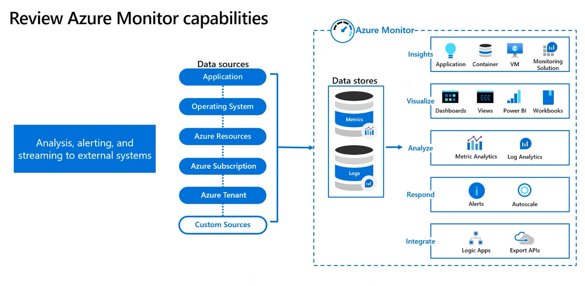

- Analysis, alerting, and streaming to external systems
- **Data sources**: Application, OS, Azure Resources, Azure Subscription, Azure Tenant, Custom Sources
- **Data stores**: Metrics, Logs
- Based on data Azure Monitor provides: Inights (Application, Container, VM, Monitoring Solution), Visualization (Dashboards, Views, Power BI, Workbooks), Analysis (Metric Analytics, Log Analytics), Response (Alerts, Autoscale), Integration (Logic Apps, Export APIs)

Identify data sources and access method

Azure Monitor collects data automatically from a range of components

- Data tiers go from Azure applications (highest tier) to Azure platform components (lowest tier)
- The method of accessing data from each tier varies - for example, installing an agent
- Each data tier can stream to different external systems
- Prioritize and deliberate on what data sources you need

Data Sources (some of them need specific agents)

- Application data
- OS data
  - Diagnostics extension - Azure Monitoring Metrics (Windows only), Azure Event Hubs, and Azure Storage
  - Log Analytics agent - Log Analytics workspace
  - Dependency agent - VM Insights
- Azure resources data
- Azure subscription data
  - Azure directory - Azure Monitor logs, Azure storage (archiving)
- Azure tenant data

### Design authentication and authorization solutions

• Recommend a solution for securing resources with role-based access control
• Recommend an identity management solution
• Recommend a solution for securing identities

When to use identity protection

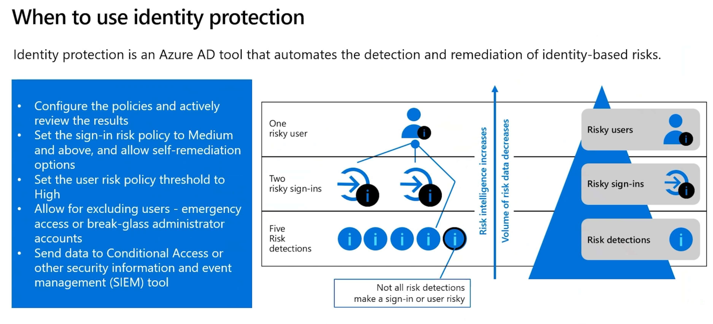

Identity protection is an Azure AD tool that automates the detection and remediation of identity-based risks.

- Configure the policies and actively review the results
- Set the **sign-in risk** policy to Medium and above, and allow self-remediation options
- Set for the **user risk** policy threshold to High
- Allow for excluding users - emergency access or break-glass administrator accounts
- Send data to Conditional Access or other security information and event management (SIEM) tool

Risk detections > Risky sign-ins > Risky users (narrowing down)

What is identity and access management

Identity

- Unified identity management
- Seamless user experience

Identity access to resources

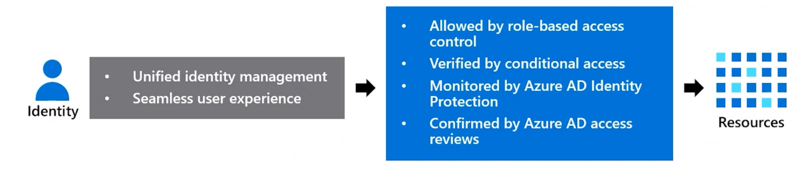

- **Allowed** by role-based access control (RBAC)
- **Verified** by conditional access
- **Monitored** by Azure AD Identity Protection
- **Confirmed** by Azure AD access reviews

Goal/Solution pairs (if you need this - use this)

- Provide identity and access management for employees in a cloud or hybrid environment - **AAD**
- Collaborate with guest users and external business partners like suppliers and vendors - **AAD B2B**
- Control how customers sign up, sign in, and manage their profiles when they use your applications - **AAD B2C**

When to use AAD B2B

AAD B2B enables you to **securely collaborate with external partners**.

- Integrate with identity providers
- Use **conditional access policies** to intelligently or deny access
- Require **MFA** for guest access

On-premises Identities > AAD Connect > AAD Identites
External Identities/AAD B2B > Invites > AAD Identities

AAD Identities:

- Internal users
- On-premise users
- Guest users (B2B)

When to use AAD B2C

AAD B2C is **a type of AAD tenant** that you use to manage customer identities and their access to your applications.

- Integrate with external user stores
- Provide single sign-on access with a user-provided identity
- Create a **custom-branded identity solution**
- Use policies to configure user journeys
- Use progressive profiling to gradually collect user information
- Pass user data to a 3rd party for validation

External identities to AAD Identities (AAD B2C tenant)

External Identities > User Flow > App Registration > Azure Identities in AAD B2C tenant

- Social IDs (Twitter, Facebook, Google, Amazon, LinkedIn, and so on), email or local accounts, Business & Government IDs
- Business & Government IDs

On-premises identities to AAD (AAD B2C tenant)

AD DS > Azure AD Connect > Azure Identities in AAD B2C tenant

When to use AAD

AAD is the Azure solution for identity and access management. AAD is a multitenant, cloud-based directory, and identity management service.

- Centralize identity management
- Establish a single AAD instance
- Use **Azure AD Connect** or **AD Connect cloud sync** for hybrid identity sync

On-premises Identities (ADDS) > AAD Connect > AAD  identities (internal users, on-premise users, guest users(B2B))

### Design governance

• Recommend an organizational and hierarchical structure for Azure resources
• Recommend a solution for enforcing and auditing compliance

Govern resources in Azure

Governance provides mechanisms and processes to maintain control over your applications and resources in Azure.

Governance involves determening your requirements, planning your activities, and setting strategic priorities.

**A typical Azure hierarchy has 4 levels (RM scopes)** within tenant root group:

- Management groups (the topmost level)
- Subscriptions
- Resource groups
- Resources

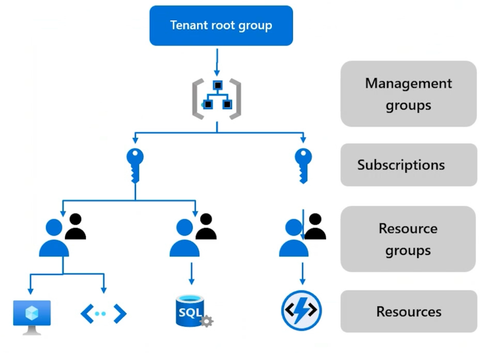

Tenant root group > Management groups > Subscriptions > Resource groups > Resources

Considerations for Azure Policy

- Apply policy at the highest scope level (management group)
- Know when policies are evaluated
- Decide what to do if a resource is non-compliant
- Consider when to automatically remediate non-compliant resources
- Use the Azure policy compliance dashboard for auditing and review
- Effectively combine Azure policy with RBAC

Built-in controls through policy instead of workflow

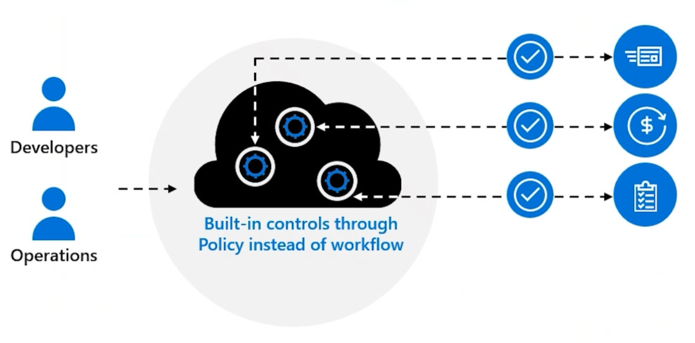

### Design identities and access for applications

• Recommend solutions to allow applications to access Azure resources
• Recommend a solution that securely stores passwords and secrets
• Recommend a solution for integrating applications into Azure Active Directory (Azure AD)
• Recommend a user consent solution for applications

Design managed identities

Managed identities provide an identity for application authentication. There are 2 types of managed identities: user managed and system managed.

Source to assign identity (entity which will be accessing target resource):

- Azure VMs
- Azure App Service
- Azure Functions
- Azure Container Instances
- AKS
- Azure Logic Apps
- ...

Target (resource to grant permission for entity to access):

- Any target that supports AAD authentication
  - Your applications
  - Azure Services (Key Vault, Azure Storage, Azure SQL, ...)

- The source is an Azure resource
- The target supports Azure AD authentication and Azure RBAC
- There is no credential rotation or certificate management

Design for Azure Key Vault

Azure Key Vault provides a secure storage area for managing all your app secrets so you can properly encrypt your data in transit or while it's being stored.

Why use Key Vault?

- Separation of sensitive app information from other configuration and code, reducing the risk of accidental leaks
- Restricted secret access with access policies tailored to the apps and individuals that need them
- Centralized secrets storage, allowing required changes to happen in only one place
- Access logging and monitoring to help you understand how and when secrets are accessed
- Implementing Customer Managed Keys for Azure services

When to consider multiple Key Vaults?

- RBAC vs Policies
- Performance

Best practices for requesting permissions

When building an application that uses AAD to provide sign-in and access tokens for secured endpoints follow best practices:

- When registering an application in AAD, consider business and security needs of **admin consent versus user consent**
- Only ask for the permissions required for implementing app functionality; don't request user consent for permissions that you haven't yet implemented for your application
- When requesting permissions for app functionality request the least-priveleged access
- Apps should **gracefully handle scenarios where user doesn't grant consent to the app** when permissions are requested

Sample questions

**Q01**: You are recommending a design for a SaaS app that will allow Azure AD users to create and publish reviews online. There will be a fron-end web app and a back-end web API. The web app will be dependent on web API to handle updates to the customer reviews.

You need to recommend a design for authorization flow for the SaaS app that meets the following:

- Access to the back-end web API, the web app must authenticate using OAuth 2 bearer tokens
- The web app must authenticate using identities of the individual users

If tokens are generated by Azure AD, which part of the solution performs the authorization?

- Azure AD
- The web API
- The web app
- Azure Key Vault

**A01**: The web API

**Q02**: An organization has an existing Azure AD tenant. They plan to deploy multiple Azure Cosmos DB databases and will use the SQL API. You are asked to recommend a solution that provides AAD user accounts with read access to the Cosmos DB databases. 

What do you recommend?

- Master keys and Azure Information Protection policies
- A resource token and an Azure control (IAM) role assignment
- SAS and conditional access management
- Azure Key Vault and certificates

**A02**: A resource token and an Azure control (IAM) role assignment

## Design data storage solutions (25–30%)

### Design a data storage solution for relational data

• Recommend database service tier sizing
• Recommend a solution for database scalability
• Recommend a solution for encrypting data at rest, data in transmission, and data in use

Select a structured data product (matching)

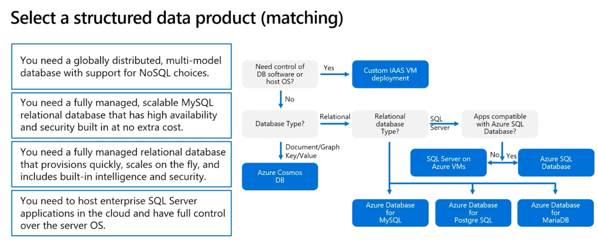

- You need a globally distributed, multi-model database with support for NoSQL choices = Azure Cosmos DB
- You need a fully managed, scalable MySQL relational database that has high availability and security built-in at no extra cost = Azure DB for MySQL
- You need a fully managed relational database that provisions quickly, scales on the fly, and includes built-in intelligence and security = Azure SQL DB
- You need to host enterprise SQL Server applications in the cloud and have **full control over the server OS** = SQL Server on Azure VMs (IaaS)

Need control of DB software or host OS? > Custom IAAS VM deployment
Database type?

- Document/Graph/Key-Value > Azure Cosmos DB
- Relational
  - SQL Server
    - Apps compatible with Azure SQL DB - Azure SQL DB
    - Apps not compatible with Azure SQL DB - SQL Server on Azure VMs
  - Azure DB for MySQL
  - Azure DB for Postgre SQL
  - Azure DB for MariaDB

Database scaling strategy

Choosing between Vertical/Horizontal scaling.

- Do you have to manage and scale multiple Azure SQL databases that have varying and unpredictable resource requirements? = **SQL elastic pools**
- Do you have different sections of the database residing in different parts of the world for compliance concerns? = **Horizontal scaling by sharding**
- Are there dependencies such as commercial BI or data integration tools where multiple databases contribute rows into a single overall result for use in Excel, Power BI, Tableau, or Cognos? - **Elastic database tools** and **elastic query** feature within it to access data spread across multiple databases

Consider costs together with your scaling strategy to find an optimal solution.

Protect your database

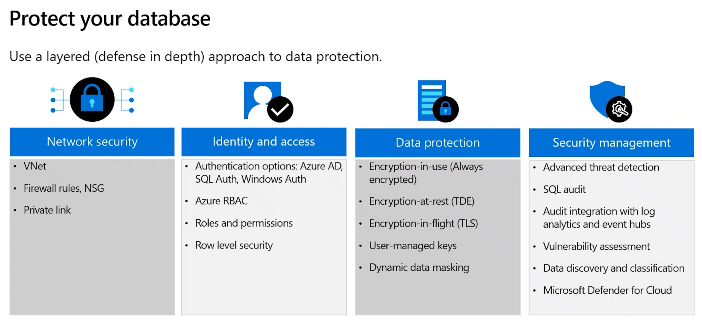

Use a layered (defence in depth) approach to data protection.

- Network security
  - VNet
  - Firewall rules, NSG
  - Private link
- Identity and access
  - Authentication options: Azure AD, SQL Auth, Windows Auth
  - Azure RBAC
  - Roles and permissions
  - Row level security
- Data protectopn
  - Encryption-in-use (Always encrypted)
  - Encryption-at-rest (TDE)
  - Encryption-in-flight (TLS)
  - User-managed keys
  - Dynamic data masking
- Security management
  - Advanced threat detection
  - SQL audit
  - Audit integration with log analytics and event hubs
  - Vulnerability assessment
  - Data discovery and classification
  - Microsoft Defender for Cloud

Authenticate to an Azure SQL database

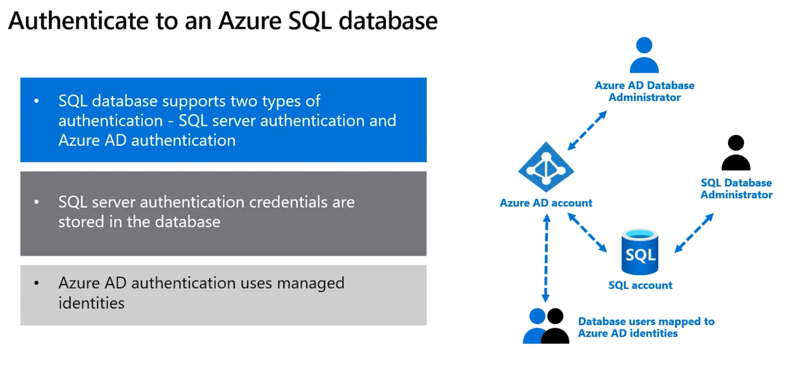

- SQL database supports 2 types of authentication - SQL server auth and Azure AD auth
- SQL server auth credentials are stored in the DB
- Azure AD auth uses managed identities

Database users mappped to Azure AD identities

### Design data integration

• Recommend a solution for data integration
• Recommend a solution for data analysis

Azure Stream Analytics

Azure Stream Analytics is a real-time analytics and complex event-processing engine that is designed to analyze and process high volumes of fast streaming data from multiple sources simultaneously.

- Analyze real-time telemetry streams from IoT devices
- Web logs/clickstream analytics
- Geospatial analytics for fleet management and driverless vehicles
- Remote monitoring and predictive maintenance of high-value assets
- Real-time analytics on point-of-sale data for inventory control and anomaly detection

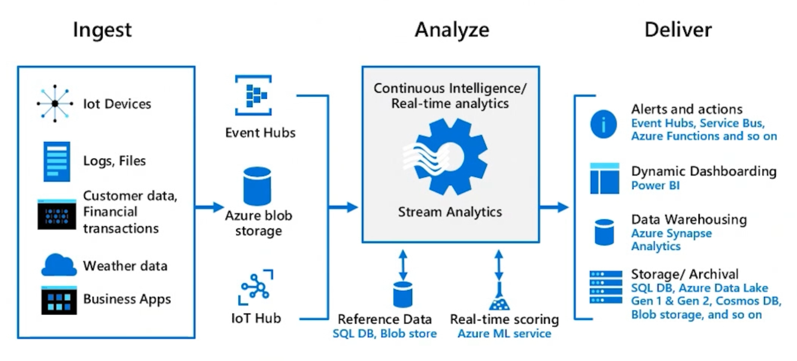

**Ingest** from IoT devices, Logs, Files, Customer data, Financial transactions, weather data, business apps) > **Event Hubs/Azure Blob Storage/IoT Hub** > 
**Analyze** with Continous Intelligence/Real-time analytics, **Stream Analytics** using Reference Data (SQL DB, Blob store), Real-time scoring (Azure ML service >
**Deliver** alerts and actions (Event Hubs, Service Bus, Azure Functions etc.), Dynamic Dashboarding (Power BI), Data Warehousing (Azure Synapse Analytics), Storage/Archival (SQL DB, Azure Data Lake Gen1 & Gen2, Cosmos DB, Blob storage, and so on)

### Recommend a data storage solution

• Recommend a solution for storing relational data
• Recommend a solution for storing semi-structured data
• Recommend a solution for storing non-relational data

Design for structured and semi-structured data

To design Azure Storage, you first must determine what type of data you have

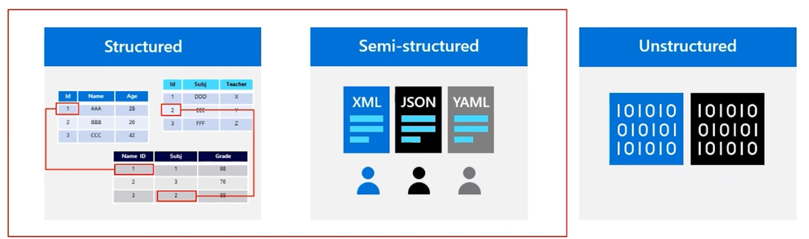

- **Structured** data includes relational data and has a shared schema
- **Semi-structured** is less organized than structured data and isn't stored in a relational format (XML, JSON, YAML)
- **Unstructured** data is the least organized type of data (Azure Blob Storage)

When to use Azure SQL databases

SQL Virtual machines - Best for migrations and applications requiring OS level access (IaaS)
Managed instances - Best for most lift-and-shift migrations to the cloud (PaaS)
Databases - Best for modern cloud applications (PaaS)

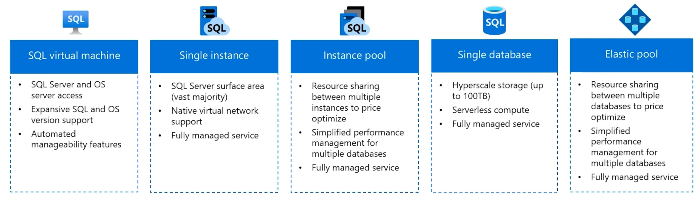

SQL VM
- SQL Server and OS level access
- Expansive SQL and OS version support
- Automated manageability features

SQL Single Instance
- SQL Server surface area (vast majority)
- Native virtual network support
- Fully managed service

SQL Instance pool
- Resource sharing between multiple instances to price optimize
- Simplified performance management for multiple databases
- Fully managed service

SQL Single database
- Hyperscale storage (up to 100TB)
- Serverless compute
- Fully managed service

SQL Elastic pool
- Resource sharing between multiple databases to price optimize
- Simplified performance management for multiple databases
- Fully managed service

When to use Azure Cosmos DB

A fully managed NoSQL database service for modern app development. It has single-digit millisecond response times and guaranteed speed at any scale.

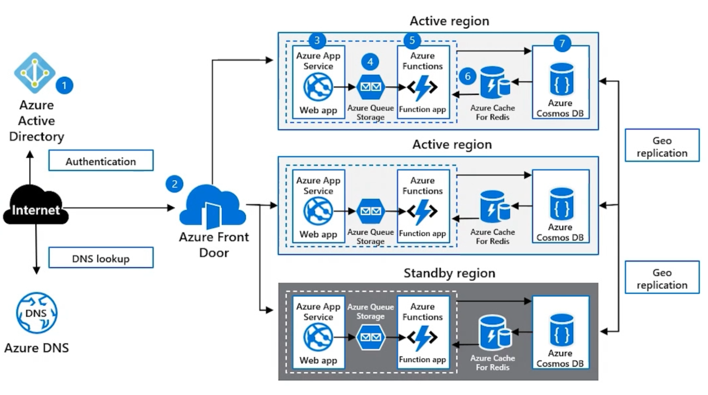

- Automatic and instant scalability
- Enterprise-grade security
- Business continuity is assured with 99,999% (5 nines) SLA-backed availability
- Turnkey multiple region data distribution anywhere in the world
- Build fast with no-ETL analytics over operational data
- Broad API compatbility
- Pricing based on **usage and storage**

Azure Storage tables and Azure Cosmos DB tables

**Azure Table storage** is a service that stores non-relational structured data (also known as structured NoSQL data) in the cloud, providing a key/attribute store with a schemaless design.

**Azure Cosmos DB** provides the Table API for applications that are written for Azure Table storage and that need premium capabilities like HA, scalability, and dedicated throughput

Differences in behavior:

- You are charged for capacity of an Azure Cosmos DB table as soon as it is created, even if that capacity isn't used
- Query results from Azure Cosmos DB are not stored in order of partition key and row key as they are from Storage tables
- Row keys in Azure Cosmos DB are limited to 255 bytes
- Cross-Origin Resource Scharing (CORS) is supported by Azure Cosmos DB
- Table names are case-sensitive in Azure Cosmos DB, but they are not case-sensitive in Storage tables

Considerations for storage accounts

It is important to plan your storage accounts.

- Location - for performance reasons, locate the data close to users - one storage account for each location.
- Compliance - regulatory guidelines for keeping data in a specific location / Internal requirements for auditing or storing data
- Cost - the settings for the account do influence the cost of services in the account
- Replication - data storage could hava different replication strategies
- Administrative overhead - each storage account requires some time and attention from an administrator to create and maintain
- Security/Data sensitivity - data plane security and data storage security

### Design a data storage solution for non-relational data

• Recommend access control solutions to data storage
• Recommend a data storage solution to balance features, performance, and cost
• Design a data solution for protection and durability

Compare Azure Data Lake to Azure Blob storage

Azure Data Lake

- Data type: Good for storing large volumes of text data
- Geographic redundancy: Need to set up replication of data
- Namespace support: Supports hierarchical namespaces
- Hadoop compatibility: Hadoop services can use data stored in Data Lake
- Security: Allow for more granular access

Azure Blob Storage

- Data type: Good for storing unstructured non-text based data such as photos, videos, backup, etc.
- Geographic redundancy: By default, provides geo redundant storage
- Nampespace support: Supports flat namespaces
- Hadoop compatibility: Is not Hadoop compatible
- Security: Granular access not supported

Determine the storage tier

Blob storage is an object store used for storing vast amounts of unstructured data.

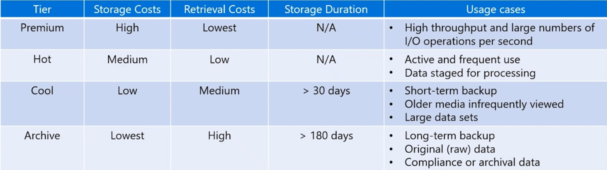

Premium tier - High storage costs / Lowest retrieval costs - Use for high throughput and large numbers of I/O operations per second
Hot tier - Medium storage costs / Low retrieval costs - Use for active and frequently used data, data stored for processing
Cool tier - Low storage costs / Medium retrieval costs / For data stored > 30 days - Use for short-term backup, older media infrequently viewed, large data sets
Archive tier - Lowest storage costs / High retrieval costs / For data stored > 180 days - Use for long-term backup, original (raw) data, compliance or archival data

- Use lifecycle rules to transition blob data to the appropriate tiers
- Consider a data lifecycle rule to expire or delete data

Considerations for storage security (for storage accounts)

Use layered security model to secure and control access.

- Firewall policies/Enanble secure tranasfer
- Customer-managed keys
- Service endpoints/Private endpoints

- Grant limited access to Azure Storage resources
- Enable firewall rules to limit access to IP addresses or subnets
- Use private endpoints and private links for clients
- Use virtual network service endpoints to provide direct connection
- Use customer managed encryption keys

Sample questions

**Q01**: You are asked to recommend a data storage solution to fit the following requirements:
- Applications must be able to have access to data using a REST connection
- The storage solution must hold costs to a minimum
- The solution will host 30 independent tables of changing sizes and varied usage patterns
- Automatic replication of the data to a second Azure region

What do you recommend?
- Use of tables within an Azure Storage account using geo-redundant storage (GRS)
- An Azure SQL Database elatic database pool using active geo-replication
- Use of tables within an Azure Storage account using Read-Access Geo-Redundant storage (RA-GRS)
- An Azure SQL Database using active geo-replication

**A01**: Use of tables within an Azure Storage account using geo-redundant storage (GRS)

Explanation:
**Geo-Redundant Storage (GRS)** provides 16 nines of durability, leveraging a primary and secondary region over a year. Data is protected within an individual data center or in a single region. **Data is available in read-only mode in the secondary region when there is a failure in the primary region.**
**Read Access Geo-Redundant Storage (RA-GRS)** replicates data to another data center in a secondary zone. Unlike GRS, where you only have access to the secondary region with failure in the first, **RA-GRS provides secondary regional access regardless of whether the primary region has failed**.

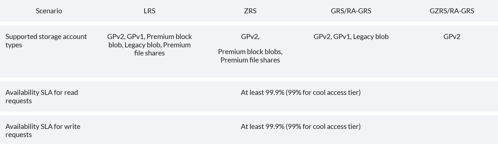

**Q02**: You are recommending a service for an organization that has the following requirements:
- The data stores should be Azure Blob storage
- They want to transform the data and move it to Azure Data Lake storage
- The solution must ensure that the data is transformed by mapping data flow

Which of the services below do you recommend?

- Azure Databricks
- Azure Stack Hub
- Azure Data Factory
- Azure SQL Server Migration assistant

**A02**: Azure Data Factory

Explanation:
ADF can transform the data and move it to Azure Data Lake storage, and with ADF the data is transformed by mapping data flow.

## Design business continuity solutions (10–15%)

### Design a solution for backup and disaster recovery

• Recommend a recovery solution for Azure, hybrid, and on-premises workloads that meets
recovery objectives (Recovery Time Objective [RTO], Recovery Level Objective [RLO], Recovery
Point Objective [RPO])
• Understand the recovery solutions for containers
• Recommend a backup and recovery solution for compute
• Recommend a backup and recovery solution for databases
• Recommend a backup and recovery solution for unstructured data

**Considerations for soft delete**

Consider soft delete with recovery times from 1 to 365 days.

- Maintains the deleted data in the system  for a specified period of time
- Soft delete protects blobs, snapshot, containers, or versions from accidental deletes or overwrites
- Soft delete maintains the deleted data in the syste, for a specified retention period

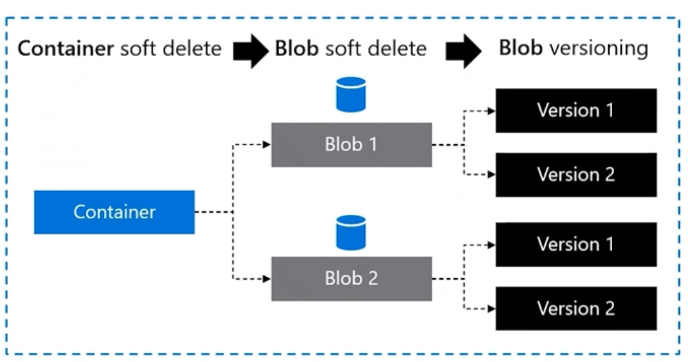

Container soft delete > Blob soft delete > Blob versioning

**Considerations for point-in-time restore**

Consider point-in-time restore for bock blobs.

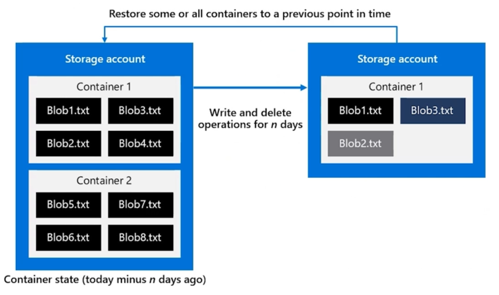

- Useful in scenarios where a user or application accidentally deletes data or where an application error corrupts data
- Use policy to specify the retention period

**Recommend a disaster recovery method (matching)**

Azure Backup / Azure Site Recovery / VM Snapshot / Microsoft Azure Backup Server (MABS)

You need to back up on-premises machines and workloads > Azure Backup / MABS
You have Azure VMs running production workloads > Azure Backup
You need application consistent backups for Linux virtual machines > Azure Backup
You need to backup your managed disks at any point in time > VM Snapshot
You need a read-only full copy of a managed disk > VM Snapshot
You need to cover disaster scenarios like an entire regional outage > Azure Site Recovery

**How Azure SQL backup works**

SQL Database and SQL Managed Instances automatically backup.

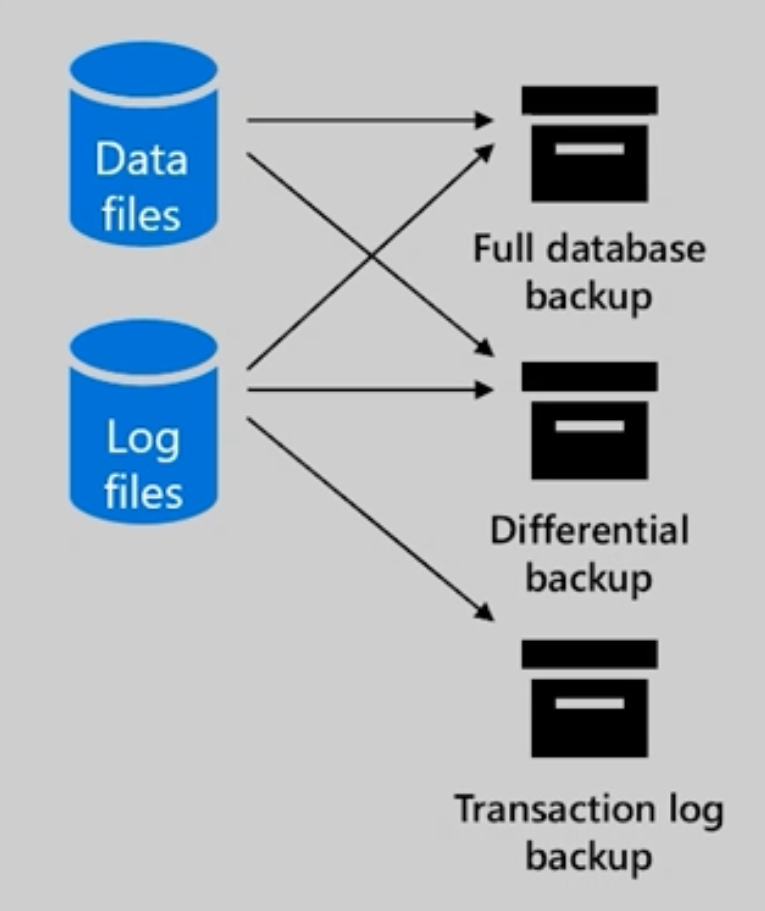

Full backups once a week
- Full backups once a week
- Differential backups every 12-24 hours
- Transactional log backups every 5-10 minutes

**Considerations for Azure SQL Backup**

zzz

### Design for high availability

• Identify the availability requirements of Azure resources
• Recommend a high availability solution for compute
• Recommend a high availability solution for non-relational data storage
• Recommend a high availability solution for relational data storage
Design infrastructure solutions (25–30%)
Design a compute solution
• Recommend a virtual machine-based compute solution
• Recommend an appropriately sized compute solution based on workload requirements
• Recommend a container-based compute solution
• Recommend a serverless-based compute solution
Design an application architecture
• Recommend a caching solution for applications
• Recommend a messaging architecture
• Recommend an event-driven architecture
• Recommend an automated deployment solution for your applications
• Recommend an application configuration management solution
• Recommend a solution for API integration
Design migrations
• Evaluate a migration solution that leverages the Cloud Adoption Framework for Azure
• Assess and interpret on-premises servers, data, and applications for migration
• Recommend a solution for migrating applications and virtual machines
• Recommend a solution for migrating databases
• Recommend a solution for migrating unstructured data
Design network solutions
• Recommend a network architecture solution based on workload requirements
• Recommend a connectivity solution that connects Azure resources to the internet
• Recommend a connectivity solution that connects Azure resources to on-premises networks
• Optimize network performance for applications
• Recommend a solution to optimize network security
• Recommend a load balancing and routing solution

## Useful links

[Preparing for AZ-305 - Design identity, governance, and monitoring solutions (segment 1 of 4) - 20,55 min](https://docs.microsoft.com/en-us/shows/exam-readiness-zone/preparing-for-az-305-design-identity-governance-and-monitoring-solutions-segment-1-of-4)

[Preparing for AZ-305 - Design data storage solutions (segment 2 of 4)](https://docs.microsoft.com/en-us/shows/exam-readiness-zone/preparing-for-az-305-design-data-storage-solutions-segment-2-of-4)

[Preparing for AZ-305 - Design business continuity solutions (segment 3 of 4)](https://docs.microsoft.com/en-us/shows/exam-readiness-zone/preparing-for-az-305-design-business-continuity-solutions-segment-3-of-4)

[Preparing for AZ-305 - Design infrastructure solutions (segment 4 of 4)](https://docs.microsoft.com/en-us/shows/exam-readiness-zone/preparing-for-az-305-design-infrastructure-solutions-segment-4-of-4)
