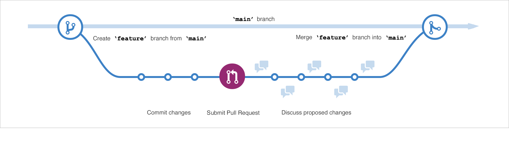

# GitHub Foundations

## Intro to Git

- Version control definition
- Distributed version control systems, like Git
- Git vs GitHub
- Create and configure new Git project
- Make and track changes to code by using Git
- Use Git to recover from simple mistakes

### What is version control

**Version control system (VCS)** is a program or set of programs that tracks changes to a collection of files. One goal of a VCS is to easily recall earlier versions of individual files or of the entire project. Another goal is to allow several team members to work on a project, even on the same files, at the same time without affecting each other's work.

Another name for a VCS is a software configuration management (SCM) system. The two terms often are used interchangeably. Technically, version control is just one of the practices involved in SCM. A VCS can be used for projects other than software, including books and online tutorials.

### Distributed VCS

Earlier instances of VCSes, including CVS, Subversion (SVN), and Perforce, used a centralized server to store a project's history. This centralization meant that the one server was also potentially a single point of failure.

Git is distributed, which means that a project's complete history is stored both on the client and on the server. You can edit files without a network connection, check them in locally, and sync with the server when a connection becomes available. If a server goes down, you still have a local copy of the project. Technically, you don't even have to have a server. Changes could be passed around in e-mail or shared by using removable media.

### Git Terminology

- Working tree - the set of nested directories and files that contain the project that's being worked on
- Repository (repo) - the directory, located at the top level of a working tree, where Git keeps all the history and metadata for a project
- **Bare repository** -  repo that isn't part of a working tree used for sharing or backup, a bare repo is usually a directory with a name that ends in .git; in other words bare repo is a repo without working tree, just repo's metadata folder, hence no commmits can be made into it (can be created with `git init bare`)
- Hash - A number produced by a hash function that represents the contents of a file or another object as a fixed number of digits, 160 bits long, used to track file changes (takes precedence over filte time-and-date stamp)
- Object -  a Git repo contains four types of objects, each uniquely identified by an SHA-1 hash
    - blob - an ordinary file
    - tree - directory, which contains names, hashes, and permissions
    - commit - specific version of the working tree
    - tag - name attached to a commit
- Commit - action of creating commit
- Branch - a named series of linked commits, the most recent commit on a branch is called the head
- Default branch - branch created when you initialize a repository, usually called main or master in Git, the head of the current branch is named HEAD
- Remote - a named reference to another Git repository, when you create a repo, Git creates a remote named origin that is the default remote for push and pull operations
- Commands, subcommands, and options - Git operations are performed by using **commands** like `git push` and `git pull`. `git` is the command, and `push` or `pull` is the **subcommand**. The subcommand specifies the operation you want Git to perform. Commands frequently are accompanied by **options**, which use hyphens (-) or double hyphens (--). For example, `git reset --hard`.

### Git & GitHub

Git is a distributed version control system (DVCS) that multiple developers and other contributors can use to work on a project. It provides a way to work with one or more local branches and then push them to a remote repository.

GitHub is a cloud platform that uses Git as its core technology. GitHub simplifies the process of collaborating on projects and provides a website, more command-line tools, and overall flow that developers and users can use to work together. GitHub act s as the remote repository.

GitHub features:

- Issues
- Discussions
- Pull requests
- Notifications
- Labels
- Actions
- Forks
- Projects

### Git commands recap

```bash
git config --global user.name "Username"
git config --global user.email "user@donmain.com"
git config --list
mkdir testrepo
cd testrepo
git init
touch index.html
git status
git add . # or git add index.html
git commit index.html -m "Commit message"
vim index.html # modify file
git status
git commit -a -m "Commit message" # -a - add all changed files - added, modified, deleted
# ervery commit creates a version of modified file(s)
git log --oneline
vim index.html # modify file again
git diff # to see differences between the working directory and the most recent commit
code .gitignore
git status
git add -A # -A add any file that is not currently tracked
git commit -am "Commit message" # -am -  include all changes and add commit message
mkdir CSS
touch CSS/.git-keep # this file indicates to Git that this file structure has to be tracked, otherwise Git doesn't track empty folders
git add CSS
rm CSS/.git-keep
code CSS/site.css
git add .
git commit -am "To add css file" # -am -  include all changes and add commit message
git log --oneline

# Fix small error in the latest commit without creating another commit and without changing commit message
# Fixing a typo within committed file
git commit --ammend --no-edit

# Restoring deleted file - 2 scenarios
# 1 Restore deleted file from the latest commit 
rm index.html
git checkout -- index.html
# 2 Remove file from git tracking and from the working directory (with that we cannot resotore file as shown above)
git rm index.html
# To restore
git reset HEAD index.html # resets tracking of specified file to the most recent commit aka HEAD
git checkout -- index html

# Recovering after committing unwanted changes
git reset --hard HEAD^ # reset to the version right before HEAD/the latest commit 
git checkout -- CSS/site.css

# Revert to Nth prvious commit
git checkout COMMIT_HASH . # . means restore all the repo

# Other option is commit squashing - combining multiple commits into one
# Interactive rebase
git rebase -i HEAD~3
```

### Configure git

```Bash
git --version
git config --global user.name "<USER_NAME>"
git config --global user.email "<USER_EMAIL>"
git config --list
mkdir project
cd project
git init --initial-branch=main # OR git init -b main
git status
ls -a
# .git folder - stores metadata and the status of the working tree changes to keep track of what's changed in your files
git --help
```

### Basic Git commands

```Bash
git status # displays the state of the working tree & of the staging area
git add # stage changes to prepare for a commit, added but not committed changes are stored in staging area
git commit # save/snapshot staged changes
git log # shows info about previous commits
git help
git <command> --help
git help tutorial
git help tutorial-2
git help everyday
```

## Introduction to GitHub

### What is GitHub?

GitHub is a cloud-based platform that uses Git, a distributed version control system, at its core. The GitHub platform simplifies the process of collaborating on projects and provides a website, command-line tools, and overall flow that allows developers and users to work together.

GitHub provides an AI powered developer platform to build, scale, and deliver secure software.

Core pillars of the GitHub Enterprise platform:

- **AI** - enhancing collaboration through AI-powered pull requests and issues, productivity through Copilot, and security by automating security checks faster
- **Collaboration** - Repositories, Issues, Pull Requests, and other tools help to enable developers, project managers, operation leaders, and others at the same company to work faster together, cut down approval times, and ship more quickly.
- **Productivity** - accelerated with automation, built-in CI/CD tools directly integrated into the workflow
- **Security** - your code remains private within your organization, and at the same time you are able to take advantage of security overview and **Dependabot**
- **Scale**

#### Inroduction to repos

A repository contains all of your project's files and each file's revision history. You can use repositories to manage your work, track changes, store revision history and work with others.

You can create a new repository on your personal account or any organization where you have sufficient permissions.

Repository visibility:
- Public - accessible to everyone on the internet
- Private - only accessible to you, people you explicitly share access with, and, for organization repositories, certain organization members

To add a file to a repository you must first have minimum Write access within the repository you want to add a file.

#### Gists

Gists are a simplified way to share code snippets with others.

Every gist is a Git repository, which you can fork and clone and can be either public or secret.

Public gists are displayed publicly where people can browse new ones as they're created. Public gists are also searchable.

Conversely, secret gists are not searchable, but they aren't entirely private. If you send the URL of a secret gist to a friend, they'll be able to see it.

#### Wikis

Every repository on GitHub.com comes equipped with a section for hosting documentation, called a wiki.

You can use your repository's wiki to share long-form content about your project, such as how to use it, how you designed it, or its core principles.

While a README file quickly tells what your project can do, you can use a wiki to provide additional documentation.

If your repository is private only people who have at least read access to your repository will have access to your wiki.

### Components of the GitHub flow

- Branches
- Commits
- PRs
- The GH flow

#### Branches

Branches allow you to make changes without affecting the entire project we're working on.

Branch is a safe place to experiment with new features or fixes. If you make a mistake, you can revert your changes or push more changes to fix the mistake. Your changes won't update on the default branch until you merge your branch.

```bash
# Create new branch and check it out
git checkout -b newBranchName
```

#### Commits

To add a new file into the repository, you need to push a commit.

A commit is a change to one or more files on a branch. Every time a commit is created, it's assigned a unique ID and tracked, along with the time and contributor. Commits provide a clear audit trail for anyone reviewing the history of a file or linked item, such as an issue or pull request.

Within a git repository, a file can exist in several valid states as it goes through the version control process. The primary states for a file in a Git repository are:

- Untracked - An initial state of a file when it isn't yet part of the Git repository. Git is unaware of its existence.
- Tracked - A tracked file is one that Git is actively monitoring. It can be in one of the following substates:
    - Unmodified - The file is tracked, but it hasn't been modified since the last commit.
    - Modified - The file has been changed since the last commit, but these changes aren't yet staged for the next commit.
    - Staged - The file has been modified, and the changes have been added to the staging area (also known as the index). These changes are ready to be committed.
    - Committed - the file is in the repository's database. It represents the latest committed version of the file.

#### PRs

A pull request is the mechanism used to signal that the commits from one branch are ready to be merged into another branch.

The team member submitting the pull request requests one or more reviewers to verify the code and approve the merge. These reviewers have the opportunity to comment on changes, add their own, or use the pull request itself for further discussion.

Once the changes have been approved (if approval is required), the pull request's source branch (the compare branch) is merged into the base branch.

#### The GH Flow



GitHub flow - a lightweight workflow that allows for safe experimentation. You can test new ideas and collaboration with your team by using branching, pull requests, and merging.

GitHub flow:
1) Create branch
2) Make your changes
3) Create PR and ask collaborators for feedback
4) Review and implement feedback
5) Get PR approved and merged
6) Delete your branch

### GitHub is a collaborative platform

>>>

## Exam Recap

### Domain 1 - Introduction to Git and GitHub

GitHub user profile features - metadata, achievements, profile readme, repositories, pinned repositories, and stars.

### Domain 2 - Working with GitHub Repos

GitHub Repository Template - alolows creating similar projects with a specific directory structure, branches, and files. You can make an existing repository a template, so you and others can generate new repositories with the same directory structure, branches, and files.

Primary benefits of adding README filkee to a GH repo:
- document what the project does and why the reader might find it useful
- communicate who maintains and contributes to the project
- tell users where they can get help with your project

Adding a README file to a project repository offers project information and guiding information about the project. A README file is a valuable resource for explaining a repository's purpose, setup, and usage, making it easier for contributors to understand and engage with the project.

.gitignore file - used to exclude specific files and directories from being committed to version control.

To add a new file to his GitHub repository through the command line:

```Bash
git add project.txt
git commit -m "add new project file"
git push
```
### Domain 3 - Collaboration Features

GH Gists -  allow you to share code snippets or files without granting access to the entire repository, making it ideal for review and collaboration, for example when you don't want to give a user(s) access to your private repo.

To create a PR to a repo to which you don't have write access you do a repo fork and create branch in a forked repo, then submit a PR.

To indicate whether iussue is being worked on - link a PR or branch to it to show that the fix is in progress.
When you merge a linked pull request into the default branch of a repository, its linked issue is automatically closed.

PR review actions:
- request specific changes directly within the code
- comment on specific lines of code with detailed feedback
- provide suggestions for improvements before merging

"Create a branch" option on the issue page allows to quickly create a branch associated with the issue.

GH iunbox filter queries
- reason:mentinon
- is:unread

#### Gists

Gists are actually Git repositories, meaning you can fork or clone any gist, even if you aren't the original author. You can also view a gist's full commit history, including diffs.

### Domain 4 - Modern Development

#### Codespaces

GH Codespace - uses a dev container running on a VM managed by GH.

Development containers, or dev containers, are Docker containers that are specifically configured to provide a fully featured development environment. Whenever you work in a codespace, you are using a dev container on a virtual machine.

Codespace customizations:
- codespace display name to distinguish between multiple codespaces
- machine type to have apropriate resources
- shell in a codespace (bash, zsh, fish are installed in default def container image)
- default region where codespace will be created

Deep link - allows to open a pre-configured Codespace in the browser, it takes people straight to a page for creating a codespace, with preconfigured options.

To reduce costs asssociated with GH Codespaces usage - reduce the default retention period for automatic deletion of codespaces

Inactive codespaces are automatically deleted. You can choose how long your stopped codespaces are retained, up to a maximum of 30 days. However, because GitHub Codespaces incurs **storage charges**, you may prefer to reduce the retention period by changing your default period in your personal settings for GitHub Codespaces.

#### GH Actions

Source locations for re-usable GH WF:
- a published Docker container image on Docker Hub
- any public repo
- the same repo foras your wokrflow file

A reusable workflow can be used by another workflow if any of the following is true:
- Both workflows are in the same repository.
- The called workflow is stored in a public repository, and your organization allows you to use public reusable workflows.
- The called workflow is stored in a private repository and the settings for that repository allow it to be accessed.

GitHub Copilot can automatically generate and complete entire code files based on input from user.

GitHub Copilot is an AI pair programmer that offers autocomplete-style suggestions as you code. You can receive suggestions from GitHub Copilot by writing the code you want to use or by writing a natural language comment describing what you want the code to do. GitHub Copilot analyzes the context in the file you are editing, as well as related files, and offers suggestions from within your text editor.

To offer relevant suggestions GH copilot analyzes the context in the current file and related files.

GitHub Copilot analyzes the context in the file you are editing, as well as related files, and offers suggestions from within your text editor. GitHub Copilot is powered by a generative AI model developed by GitHub, OpenAI, and Microsoft.

Order of operations for GH Actions when a PR is opened:
Event > Workflow > Job > Steps > Action 

You can configure a GitHub Actions workflow to be triggered when an event occurs in your repository, such as a pull request being opened or an issue being created. Your workflow contains one or more jobs which can run in sequential order or in parallel. Each job will run inside its own virtual machine runner, or inside a container, and has one or more steps that either run a script that you define or run an action, which is a reusable extension that can simplify your workflow.

### Domain 5 - Project Management

GitHub Projectrs vs GitHuub Projects Classic - Projects offers more customizable options for project boards and workflows compared to Projects Classic. Projects allows users to adjust the experience to their specific needs making it better for tracking progress and organizing issues and pull requests.

Roadmap layout in GitHub projects - a configurable timespan to track your issues, pull requests, and draft issues on a timeline.

To use Repository Insights user neeeds write or admin access to a project.

GitHub Projects Labels - provide a way to prioritize and categorize issues, making it easier to track and manage tasks on the project board.

Programmatic management of GH Project
- Graph QL API to manage the project
- GitHub CLI to create and manage issues and PRs

Built in GH projects metadata:
- milestones 0 track progress on groups of issues or pull requests in a repository
- labels - sed to classify issues, pull requests, and discussions
- assignees

Timestamp field can be added but it is not the one of the built-in metadata that GitHub provides.

GH Projects charts types:
- Current chart - allows to visualize your project items, for example, you can create charts to show how many items are assigned to each individual or how many issues are assigned to each upcoming iteration
- Historical chart - allows to track changes to the state of your project items, not existing items assigned to users

To assign users issues and PRs - write permissions

You can assign multiple people to each issue or pull request, including yourself, anyone who has commented on the issue or pull request, anyone with write permissions to the repository, and organization members with read permissions to the repository.

**Anyone with write access to a repository can assign issues and pull requests.**

### Domain 6 - Privacy, Security, and Administration

If org enables 2FA requirement accounts which are not elect to enable 2FA got deleted from GH org. It includes members, outside collaborators, and billing managers (including bot accounts).
GitHub accounts without 2FA will be removed immediatly from any organization that enables two-factor authentication.

2FA cannot be required for repo viewers.

Organization owners can require organization members, outside collaborators, and billing managers to enable two-factor authentication for their personal accounts, making it harder for malicious actors to access an organization's repositories and settings.  Repository viewers who have read-only access to repositories, are not subject to the organization-wide two-factor authentication requirement.

Repository Insights - allows you to see repository insights graph activity and contributor engagement of your project.

GitHub repository insights and the respective repository's graphs give you information on traffic, projects that depend on the repository, contributors and commits to the repository, and a repository's forks and network. You can use this data to get a better understanding of who's using your repository and why they're using it.

To use Repository Insights user neeeds write or admin access to a project. The only users who can use the Insights feature for Projects are those with write or admin access to the specific project.

GH Code scanning - automatically detects security vulnerabilities and coding errors in new or modified code. Potential problems are highlighted, with detailed information, allowing you to fix the code before it's merged into your default branch.  Code scanning is available for all public repositories on GitHub.com. **Code scanning is also available for private repositories owned by organizations that use GitHub Enterprise Cloud and have a license for GitHub Advanced Security**.

Code scanning for private repos is only available with GitHub Advanced Security License.

By default members of GH org can create repositories and project boards.

A **CODEOWNERS file** uses a pattern that follows most of the same rules used in gitignore files. The pattern is followed by one or more GitHub usernames or team names using the standard @username or @org/team-name format.

Disabling GH Actions on repo = no workflows run on the repository

By default, GitHub Actions is enabled on all repositories and organizations. You can choose to disable GitHub Actions or limit it to actions and reusable workflows in your organization.

You can disable GitHub Actions for your repository altogether. When you disable GitHub Actions, no workflows run in your repository.  Alternatively, you can enable GitHub Actions in your repository but limit the actions and reusable workflows a workflow can run.

By default, when you create a new repository in your personal account, workflows are not allowed to create or approve pull requests. If you create a new repository in an organization, the setting is inherited from what is configured in the organization settings.

Personal repo permission levels - ONLY TWO:
- repo owner
- collaborators

Default repo visibility options for GH Enterprise:
- Private
- Public
- Internal

Within GitHub Enterprise you can restrict who has access to a repository by choosing a repository's visibility: public, internal, or private.

GitHub Enterprise Cloud authentication options use a centralized identity provider (IdP) to control and secure access to organization resources:
- SAML single sign-on (SSO)
- Enterprise Managed Users

Both **GitHub SAML SSO** and **Enterprise Managed Users** can leverage an IdP for authentication. If you configure SAML SSO, members of your organization will continue to sign into their personal accounts on GitHub.com. When a member accesses most resources within your organization, GitHub redirects the member to your IdP to authenticate. With Enterprise Managed Users, you manage the lifecycle and authentication of your users on GitHub.com from an external identity management system, or IdP.

Pinned repos -  give users easy access to important or frequently used repositories within organization.

You can give users easy access to important or frequently used repositories, by choosing up to six repositories for public users and six repositories for members of the organization. Once you pin repositories to your organization profile, the "Pinned" section is shown above the "Repositories" section of the profile page.

GitHub Advanced Security (GHAS) license features:
- dependency review- show the full impact of changes to dependencies and see details of any vulnerable versions before you merge a pull request
- code scanning - search for potential security vulnerabilities and coding errors in your code
- secret scanning - detect secrets, for example keys and tokens, that have been checked into private repositories

Dependency Graph and Dependabot alerts are included in all plans.

Secret scanning detects secrets, for example keys and tokens, that have been checked into private repositories. Secret scanning alerts for users and secret scanning alerts for partners are available and free of charge for public repositories on GitHub.com. If push protection is enabled, also detects secrets when they are pushed to your repository.

GitHub has many features that help you improve and maintain the quality of your code. Some of these are included in all plans, such as Dependency graph and Dependabot alerts are included in all plans. Other security features require a **GitHub Advanced Security (GHAS) license** to run on repositories apart from public repositories on GitHub.com.

An organization owner who provides different levels of access to private repositories owned by his organization to:
- organization members
- ouside collaborators
- teams
via roles and permissions.

GitHub organization news feed - allows to keep up with the recent activity on repositories owned by organization

An organization's news feed shows other people's activity on repositories owned by that organization. You can use your organization's news feed to see when someone opens, closes, or merges an issue or pull request, creates or deletes a branch, creates a tag or release, comments on an open issue, pull request, or commit, or pushes new commits to GitHub.

Billing Managers can
- Upgrade or downgrade the account
- View payment history
- Update payment methods

### Domain 7 - Benefits of the GitHub Community

Following user on GH - allows you to see user's updates and activities on your personal dashboard.

Star repo/follow user - allows you to see updates on their activities on your personal dashboard.

Fork repo - create a private copy of a repo for your personal use.

GH Issue Template - used to streamline the creation of consistent issues and enhance collaboration.

GH Market Place -  allows developers to share GitHub Actions and Apps with the GitHub community (free and paid).

GH Tiopics to classify repo:
- language
- subject area
- repo's intended purpose

GitHub topics all you to explore repositories in a particular subject area, find projects to contribute to, and discover new solutions to a specific problem. 
Helpful topics to classify a repository include the repository's intended purpose, subject area, community, or language. Additionally, GitHub analyzes public repository content and generates suggested topics that repository admins can accept or reject. Private repository content is not analyzed and does not receive topic suggestions.

A fork is a new repository that shares code and visibility settings with the original upstream code repository. Forks are often used to iterate on ideas or changes before they are proposed back to the upstream repository, such as in open source projects or when a user does not have write access to the upstream repository.  Developers can use forks to propose changes related to fixing a bug without impacting the original upstream repository.

If you fork a repository and the original repository is updated, **your fork won't automatically receive those updates**. Maintainers must manually sync their forks with the original repository by creating pull requests or using Git commands to fetch and merge changes.

When you follow organizations on GitHub, you'll see their public activity on your personal dashboard:
- new discussions
- sponsorships
- repositories

**Following an organization on GitHub does not impact notifications related to changes made to the organization's profile settings**. Profile settings for organizations and individual user profiles are separate entities on GitHub. Following an organization primarily affects the visibility of public repository activities associated with that organization on your personal dashboard.

#### PR Templates

To add PR template to repo create the pull request template visible in the repository's root directory with the name pull_request_template.md